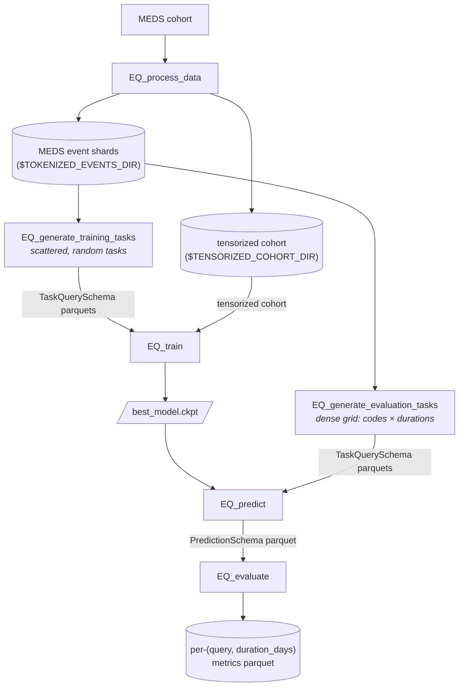

# EveryQuery

[](https://github.com/payalchandak/EveryQuery/actions/workflows/tests.yaml)
[](https://codecov.io/gh/payalchandak/EveryQuery)
[](https://www.python.org)
[](https://lightning.ai)
[](https://hydra.cc)
[](LICENSE)

Given a MEDS dataset, EveryQuery trains a ModernBERT-style encoder to answer
"query" prediction tasks of the form: *given a subject's history up to time `t`, will code
`c` occur within `d` days?* The same trained model is then evaluated against arbitrary
`(code, duration)` combinations.

EveryQuery is built on the [MEDS](https://github.com/Medical-Event-Data-Standard) ecosystem leveraging [`meds-torch-data`](https://github.com/mmcdermott/meds-torch-data) for tensorization and [`MEDS-transforms`](https://github.com/mmcdermott/MEDS_transforms) for preprocessing.

> [!IMPORTANT]
> **This fork (`conditional-v2` branch) adds a conditional query-sequence model** — a
> bidirectional patient encoder + block-autoregressive decoder that answers an ordered list of
> queries, each conditioned on the patient state and the teacher-forced answers of all earlier
> queries. Binary observed-occurrence labels; censoring is expressed by querying the real
> `TIMELINE//END` code rather than via a separate head. See
> **[CONDITIONAL_QUERIES.md](CONDITIONAL_QUERIES.md)** for the design, the new
> `EQ_generate_query_sequences` / `EQ_predict_sequences` / `EQ_evaluate_sequences` CLIs, the macro
> per-task evaluation methodology, and results.
>
> On top of that, four **query-form features** — RoPE time, event-bounded durations, ontology
> embeddings with ancestor queries, and aggregate queries — extend what a query can express. All
> four are off by default and any combination can be enabled together; see
> **[Query forms](#query-forms)** below.

## Install

**As a dependency:**

```bash
pip install EveryQuery
```

## Repository layout

Every production module lives under a submodule that reflects its role:

```
src/every_query/
├── preprocessing/      → EQ_process_data        (raw MEDS → tensorized cohort)
├── generate_tasks/     → EQ_generate_training_tasks + EQ_generate_evaluation_tasks + EQ_sample_task_tracking_pairs (TaskQuerySchema parquets: scattered for PT, dense for eval, pos/neg pairs for in-training AUROC)
├── train/              → EQ_train               (train the model)
├── predict/            → EQ_predict             (inference; consumes TaskQuerySchema, emits PredictionSchema)
│   └── external_tasks/                         (ACES + composite aggregation — currently `python -m` only;
│                                                  [#62](https://github.com/payalchandak/EveryQuery/issues/62) tracks promoting to console scripts, draft PR [#95](https://github.com/payalchandak/EveryQuery/pull/95))
├── evaluate/           → EQ_evaluate           (metrics on a PredictionSchema parquet)
├── model/              (shared: nn.Module + LightningModule; ontology-mixed embedding wrapper)
├── data/               → EQ_build_ontology       (shared: PyTorch Dataset + Batch types + TaskQuerySchema;
│                                                  query grammar, ontology DAG, RoPE time positions)
└── utils/              (helpers: seeds, code slugs, env-var validation, model_loader)
```

Every submodule has its own `README.md` explaining what belongs there, its pipeline
position, and the tracking issues for remaining work.

Research-only, paper-specific code (ID/OOD code sampling, ablations, the results notebook,
figure code, the ETHOS comparison) lives in the separate `EveryQueryExperiments` repo, which
depends on `EveryQuery` as an installed library. The split is tracked in
[#186](https://github.com/payalchandak/EveryQuery/issues/186).

## Console scripts

`pip install` exposes the CLIs below, all Hydra-configurable. Run any with `--help` or
`--cfg job` to inspect the resolved config. The **Tests** column summarises the coverage
that lands with each CLI on `dev` today — unit tests (fast, `tests/test_<name>_logic.py`
or `tests/test_<module>.py`), CLI smoke tests (`tests/test_cli_smoke.py`, `--help`-exits-0),
and end-to-end subprocess tests that run the real script against a fixture cohort.

| Script                          | Stage            | Purpose                                                                                                                 | Tests                                                                                                                    |
| ------------------------------- | ---------------- | ----------------------------------------------------------------------------------------------------------------------- | ------------------------------------------------------------------------------------------------------------------------ |
| `EQ_process_data`               | preprocessing    | Orchestrate MEDS-transforms + `meds-torch-data` tensorization                                                           | smoke; E2E via `test_process_data.py` + `test_e2e_foundation.py`                                                         |
| `EQ_generate_training_tasks`    | PT task labels   | Sample `N` tasks × `M` contexts (scattered `(query, duration_days)`), label via single-pass asof                        | smoke; unit `tests/sampler/`; E2E `test_generate_tasks.py`                                                               |
| `EQ_generate_evaluation_tasks`  | eval task labels | Sample `K` prediction times per subject, cross-join with `(codes × durations)` grid for dense evaluation shape          | smoke; E2E `test_generate_evaluation_tasks_cli.py`                                                                       |
| `EQ_sample_task_tracking_pairs` | AUROC tracking   | Sample one pos + one neg row per `(query, duration_days)` from the dense eval labels for cheap in-training AUROC        | smoke; E2E `test_sample_task_tracking_pairs_cli.py`                                                                      |
| `EQ_train`                      | training         | Train the ModernBERT encoder on the labeled tasks                                                                       | smoke; unit `test_training.py`; E2E `test_train_cli.py` + `test_train.py`; signal test `tests/training_validity/` (slow) |
| `EQ_predict`                    | inference        | Consume a `TaskQuerySchema` parquet dir + checkpoint, emit a `PredictionSchema` parquet (`censor_prob`, `occurs_prob`)  | smoke; E2E `test_predict_cli.py` (row-order preserved); exercised by `tests/training_validity/` (slow)                   |
| `EQ_evaluate`                   | metrics          | Consume a `PredictionSchema` parquet, write per-`(query, duration_days)` metrics (`occurs_auroc`, `censor_auroc`, etc.) | smoke; E2E `test_evaluate_cli.py`; exercised by `tests/training_validity/` (slow)                                        |

The conditional query-sequence pipeline (this fork) adds a parallel set of CLIs that consume and
emit `QuerySeqSchema` rather than `TaskQuerySchema` — see
[CONDITIONAL_QUERIES.md](CONDITIONAL_QUERIES.md):

| Script                                   | Stage              | Purpose                                                                                                                                            | Tests                                                     |
| ---------------------------------------- | ------------------ | -------------------------------------------------------------------------------------------------------------------------------------------------- | --------------------------------------------------------- |
| `EQ_generate_query_sequences`            | PT seq labels      | Sample `K` queries per `(subject, prediction_time)` context and label each by observed occurrence (`QuerySeqSchema` parquets)                      | `test_conditional_cli.py`                                 |
| `EQ_generate_evaluation_query_sequences` | eval seq labels    | Label the same `N` query sequences across a supplied cohort (dense grid counterpart)                                                               | `test_conditional_cli.py`                                 |
| `EQ_predict_sequences`                   | inference          | Consume `QuerySeqSchema` + a conditional checkpoint, emit per-position probabilities                                                               | `test_conditional_cli.py`                                 |
| `EQ_evaluate_sequences`                  | metrics            | Per-position and macro per-task metrics over conditional predictions                                                                               | `test_conditional_cli.py`                                 |
| `EQ_build_ontology`                      | ontology artifacts | Derive the code-ontology DAG from a cohort's `codes.parquet` (`nodes`/`mix`/`closure` parquets) for ancestor queries and ontology-mixed embeddings | `test_ontology.py`; E2E `test_features_e2e_cli.py` (slow) |

The legacy four-stage evaluator (`every_query.evaluate.eval`, with `gen_index_times`, `gen_task`, `select_model` siblings) has been deleted; recover from git history if needed. [#83](https://github.com/payalchandak/EveryQuery/issues/83) tracks the cross-model leaderboard, which now lives in the `EveryQueryExperiments` repo.

## Pipeline

### Current (on `dev`)



Both task-generation endpoints emit `TaskQuerySchema`-conformant parquets. Training uses the scattered shape (one random `(query, duration_days)` per row); evaluation uses the dense shape (every held-out `(subject, time)` × every `(query × duration)` the user wants metrics for) so `EQ_predict` + `EQ_evaluate` cover a full grid without having to run inference twice.

### 1. Preprocess

```bash
EQ_process_data \
	input_dir="$DATA_DIR" \
	intermediate_dir="$TOKENIZED_EVENTS_DIR" \
	output_dir="$TENSORIZED_COHORT_DIR"
```

Produces a tensorized MEDS cohort under `$TENSORIZED_COHORT_DIR`. `$TOKENIZED_EVENTS_DIR` is a staging
directory for the MEDS-transforms stages; `$TENSORIZED_COHORT_DIR` holds cross-shard metadata
(`$TENSORIZED_COHORT_DIR/metadata/codes.parquet` is the query-code universe the sampler draws from).

### 2a. Generate pre-training task labels

```bash
EQ_generate_training_tasks \
	split=train \
	num_queries=4000000 \
	num_contexts_per_query=1 \
	max_workers=1 \
	data_dir="$TOKENIZED_EVENTS_DIR" \
	out_dir="$TRAINING_TASKS_DIR" \
	query_codes="$TENSORIZED_COHORT_DIR"
```

`data_dir` is the MEDS dataset root (event shards read from `{data_dir}/data/{split}/*.parquet`) and `out_dir` is the final-dataset root. Both are required Hydra args (no `.env` fallback — see [#235](https://github.com/payalchandak/EveryQuery/issues/235)); pass them as shell-expanded vars after `source env.sh`.

One command runs the whole 5-stage sampler in a single process (Stages 0–3 inline, then Stage 4 labels shards in parallel). The dataset lands at `$TRAINING_TASKS_DIR/{split}/{shard}.parquet`, with intermediates in the sibling `*_artifacts` dir (see [`generate_tasks/README.md`](src/every_query/generate_tasks/README.md)). Columns conform to [`TaskQuerySchema`](src/every_query/data/schema.py) — `subject_id, prediction_time, query, duration_days, boolean_value` — where `boolean_value` is three-valued: `True` (query code occurs in `(prediction_time, prediction_time + duration_days]`), `False` (window fully observed, no occurrence), or `null` (censored — window extends past the subject's last recorded time).

> `max_workers` sets how many shards are labeled in parallel, so raising it raises peak RAM. If Stage 4 OOMs, set `max_workers=1`.

> **Note:** The total number of training samples generated will be `num_queries * num_contexts_per_query`

`query_codes=` is required for training. Set it to a metadata root (`query_codes=$TENSORIZED_COHORT_DIR`) to
sample from `{dir}/metadata/codes.parquet`, or to an inline list / YAML path to restrict which codes
can be sampled as queries. YAML files may be a flat list or a mapping with a `codes:` key. This does
not remove codes from patient histories.

```bash
EQ_generate_training_tasks query_codes=/path/to/train_query_codes.yaml …
```

```yaml
# train_query_codes.yaml
codes:
  - HR
  - TEMP
```

### 2b. Generate evaluation task labels

```bash
EQ_generate_evaluation_tasks \
	split=held_out \
	prediction_times_per_subject=5 \
	'query_codes=[HR, TEMP]' \
	'durations=[1, 7, 30, 90, 365]' \
	data_dir="$TOKENIZED_EVENTS_DIR" \
	out_dir=$EVAL_TASKS_DIR
```

Samples `1` prediction times per subject by default, cross-joins with the full `(codes × durations)` grid, labels via the same primitive as training. Output lands under `$EVAL_TASKS_DIR/eval/{split}/*.parquet` (separate `eval/` subdir so it doesn't collide with the training-task output).

The endpoint discovers every shard under `{data_dir}/data/{split}/*.parquet` and processes them all in one invocation, writing one output parquet per shard — no shard counting, no `-m input_shard=...` sweep (removed in #279; passing `input_shard=` now fails as an unknown override). The prediction-time sampler is deterministic per shard in `(seed, input_shard, split)`, so outputs are identical to the old exhaustive sweep. Reruns skip shards whose outputs already exist unless `overwrite=true`.

As with training, `data_dir` / `out_dir` are required Hydra args (pass them as shell-expanded vars). `query_codes` is also required — it is the evaluation query universe.

`query_codes=` accepts an inline list (as above), a metadata root / `codes.parquet` path (`query_codes=$TENSORIZED_COHORT_DIR` reads `{dir}/metadata/codes.parquet`), or — for reproducible pre-sampled code universes kept out of git — a path to a YAML file. The YAML is either a bare list or a mapping with a `codes:` key:

```yaml
# sampled_codes.yaml
codes:
  - HR
  - TEMP
  - ICD//A01
```

```bash
EQ_generate_evaluation_tasks query_codes=/path/to/sampled_codes.yaml …
```

### 3. Train

```bash
EQ_train \
	datamodule.config.tensorized_cohort_dir="$TENSORIZED_COHORT_DIR" \
	datamodule.config.task_labels_dir="$TRAINING_TASKS_DIR" \
	output_dir="$TRAINING_OUTPUT_DIR"
```

- `output_dir` is a required Hydra arg that is a base path you supply with `output_dir=`, e.g. `=$TRAINING_OUTPUT_DIR`. Hydra appends `<YYYY-MM-DD>/<HH-MM-SS>` for per-run uniqueness.
- If you want to override more parameters for training refer to `src/every_query/train/configs/config.yaml`

#### Optional: in-training macro-AUROC tracking

`EQ_train` can log a cheap, macro-averaged per-task AUROC estimate every validation pass
(`tuning/occurs_auroc_macro_sampled`, plus `..._n_tasks` for how many tasks contributed) via
`TaskAurocTrackingCallback`. Instead of scoring the whole tuning split, it scores a fixed,
offline-sampled parquet of exactly one positive + one negative row per `(query, duration_days)`
task. Because a task's AUROC equals `P(score(pos) > score(neg))` for a random pos/neg pair, the
win/tie/loss on that one pair is an unbiased (high-variance) estimate; macro-averaging across
tasks gives macro AUROC at `O(n_tasks)` forward examples. It is **tracking-only** — it does not
affect `tuning/loss`-driven checkpointing or early stopping.

First sample the tracking pairs once from the dense **tuning**-split eval labels (output of
`EQ_generate_evaluation_tasks`):

```bash
EQ_sample_task_tracking_pairs \
	eval_labels_dir="$EVAL_TASKS_DIR/eval" \
	out_dir="$TASK_TRACKING_DIR" \
	split=tuning
# pairs land at $TASK_TRACKING_DIR/tuning/0.parquet
```

Then enable the callback via its Hydra config group and point `task_labels_dir` at
`$TASK_TRACKING_DIR`:

```bash
EQ_train +callbacks=task_auroc \
	++trainer.callbacks.task_auroc_tracking.config.task_labels_dir="$TASK_TRACKING_DIR"
```

`+callbacks=task_auroc` composes `configs/callbacks/task_auroc.yaml` into the callbacks list.
It is off by default — `config.yaml` ships `task_auroc_tracking: null`, and `values_as_list`
drops `None` entries, so a plain `EQ_train` (e.g. when EveryQuery is used as a dependency) runs
without it and without needing any tracking pairs. Notes:

- The split is locked to `tuning` on purpose — tracking mirrors `tuning/loss` checkpointing, so
    it is not configurable. Sample the pairs with `split=tuning`.
- Out-of-vocab query codes (not in the model vocab) are skipped at scoring; the callback warns at
    setup and you'll see a smaller `..._n_tasks`. An empty tracking set logs a warning and simply
    never logs the metric (training is unaffected).
- Under DDP it scores on rank 0 only (the tracking set is identical on every rank), and the
    parquet is read once at setup — re-sampling mid-run requires a restart.
- To disable it entirely, just omit `+callbacks=task_auroc` (the default). The mandatory
    `task_labels_dir: ???` only errors when the group is actually enabled.

### 4. Predict

```bash
EQ_predict \
	model_run_dir="$TRAINING_OUTPUT_DIR/YYYY-MM-DD/HH-MM-SS" \
	tasks_dir="$EVAL_TASKS_DIR/eval/held_out" \
	output_parquet="$TRAINING_OUTPUT_DIR/predictions.parquet" \
	split=held_out
```

Reads every `*.parquet` under `tasks_dir` (`TaskQuerySchema`-conformant), runs the checkpoint's `predict_step` over the chosen split, writes a single `PredictionSchema` parquet with `censor_prob` + `occurs_prob` per input row. See [`predict/README.md`](src/every_query/predict/README.md) for details.

### 5. Evaluate

```bash
EQ_evaluate \
	predictions_parquet="$TRAINING_OUTPUT_DIR/predictions.parquet" \
	metrics_parquet="$TRAINING_OUTPUT_DIR/metrics.parquet"
```

Per-`(query, duration_days)` metrics from the predictions parquet — `n_rows`, `n_occurs_labeled`, `n_positive`, `prevalence`, `occurs_auroc` (on non-censored rows), `censor_auroc`. See [`evaluate/README.md`](src/every_query/evaluate/README.md).

## Query forms

Out of the box, a query is *"will code `c` occur within `d` days?"*. Four **query-form features**
extend that — three change *what can be asked*, one changes *how the encoder sees time*. All four
are ported into `ConditionalQueryModel` from the upstream experiment forks (see
[CONDITIONAL_QUERIES.md](CONDITIONAL_QUERIES.md) for the model itself).

They are folded into the one model behind flags rather than shipped as the forks' four separate
subclass towers, so **any combination can run together** — pinned by
`tests/test_feature_composition.py`, and end-to-end through real subprocesses by
`tests/test_features_e2e_cli.py`. **Every feature is off by default**, and a run with all of them
off produces byte-identical output to a pre-feature run.

| Feature                                            | What it adds                                                          | Sampler knobs                         | `EQ_train` knobs                                                                        | Tests                       |
| -------------------------------------------------- | --------------------------------------------------------------------- | ------------------------------------- | --------------------------------------------------------------------------------------- | --------------------------- |
| [RoPE time](#rope-time-representation)             | Elapsed **hours** as rotary positions instead of token index          | —                                     | `lightning_module.model.use_rope_time` + `datamodule.dataset_kwargs.strip_delta_tokens` | `test_rope_time.py`         |
| [Event bounds](#event-bounded-duration-queries)    | *"…before the next discharge?"* instead of *"…within 30 days?"*       | `eventbound_fraction`, `bound_events` | — (read from the labels)                                                                | `test_event_bounded.py`     |
| [Ontology](#ontology-embeddings--ancestor-queries) | *"…any drug in this **class**?"* — query an ancestor, not a leaf code | `ontology_dir`, `ancestor_fraction`   | `lightning_module.model.ontology_dir` + `datamodule.dataset_kwargs.ontology_dir`        | `test_ontology.py`          |
| [Aggregates](#aggregate-queries)                   | *"…A **and** B? A **then** B? A **with** B?"* — 7 operators           | `aggregate_fraction`                  | `datamodule.dataset_kwargs.aggregate_queries`                                           | `test_aggregate_queries.py` |

The sampler knobs go to **both** `EQ_generate_query_sequences` and
`EQ_generate_evaluation_query_sequences`, which are asserted key-identical on every sampling knob —
a knob that drifts between the training sampler and the eval grid silently invalidates the grid.

> [!IMPORTANT]
> **The sampling fractions are a zero-sum draw on a fixed query budget.** Every event-bounded,
> ancestor, or aggregate query is one fewer ordinary horizon query. Upstream measured the cost of
> turning on just *one* 50% diet: −0.0088 AUROC on scalar tasks for event bounds, −0.0052 for
> aggregates — both significant. Switching everything on at once gives each form ~12–25% of the
> budget and charges the atomic baseline every cost simultaneously.
>
> Run **one query form at a time** first (the fractions exist so the other arms can be set to `0`),
> and combine only after each has been shown to work alone. None of these mechanisms had been
> trained on `ConditionalQueryModel` before this port — the fork results all come from other
> architectures, chiefly a `PrefixConditionalQueryModel` this repo does not have.

### RoPE time representation

The MEICAR-style token stream interleaves quantized `TIMELINE//DELTA//*` tokens with real clinical
events, so elapsed time is recoverable only by summing those categorical tokens. This feature drops
the delta tokens from the encoder input and feeds each remaining token's **elapsed hours** to
ModernBERT's rotary machinery as `time_pos_ids`. Attention then sees *continuous relative time*
rather than token distance plus quantized deltas. Dropping the delta tokens also shortens sequences
materially (~13% on MIMIC-IV upstream), so more real events fit in a fixed `max_seq_len` — that is
part of the change under test, not an incidental effect.

```bash
EQ_train --config-name=conditional_config \
	++datamodule.dataset_kwargs.strip_delta_tokens=true \
	++lightning_module.model.use_rope_time=true \
	…
```

The two flags must be set **together**: `strip_delta_tokens` is what emits the positions, and
`use_rope_time` is what consumes them. Pairing a RoPE checkpoint with a dataset built without the
strip is a **hard error**, not a silent fallback — the upstream experiment fell back silently and
had to issue an erratum after a full eval grid had been scored against a model that never received
its time positions. Cumulative time is summed *before* the delta tokens are dropped, since dropping
them first would discard the elapsed time they encode. Rotary frequencies are computed from
`position_ids` on the fly, so elapsed-hour values far past `max_position_embeddings` are
well-defined; only the local-attention sliding window stays token-index based, deliberately (its
windows are over neighbouring events, not hours).

No sampler change is needed — this is purely an encoder-side time representation.

### Event-bounded duration queries

An event-bounded query's window ends at the **next occurrence of a boundary event** rather than
after a fixed horizon: *"will sepsis be coded before the next ICU discharge?"*. Such a query carries
its boundary code in the new optional `bound_events` column of
[`QuerySeqSchema`](src/every_query/data/schema.py), and its `durations` entry holds the
`EVENT_BOUND_DURATION_SENTINEL` (`-1.0`) instead of a horizon. The column is absent entirely from
bound-free parquets, which stay valid.

```bash
EQ_generate_query_sequences \
	eventbound_fraction=0.5 \
	'bound_events=[TIMELINE//END, MEDS_DEATH, HOSPITAL_DISCHARGE//HOME]' \
	…
```

`bound_events` is **required** once `eventbound_fraction > 0` — the codes are cohort-specific, so
generation fails rather than guessing, and a boundary code absent from the query vocabulary is a
hard error rather than a silent drop (a model that never saw the boundary cannot define the window).
The upstream MIMIC-IV set is documented in
[`sample_query_sequences_config.yaml`](src/every_query/generate_tasks/configs/sample_query_sequences_config.yaml).

The model side needs no flag: `ConditionalQueryModel` always allocates a `bound_marker` parameter,
added to the boundary code's token embedding so the model can tell *"window ends at the next X"*
from *"is X observed"* — both read the same embedding table. It is allocated unconditionally so the
parameter set never depends on which data a run happened to see, which would make checkpoints
silently incompatible.

Boundary events ride through `EQ_predict_sequences` into the predictions parquet as a `bound_event`
column, and `EQ_evaluate_sequences` puts event-bounded rows in their own `event-bound` duration
bucket and adds `bound_event` to the metric grouping key. The same code asked over two different
boundaries is two different questions; pooling them (or letting `-1.0 < 2` file them under the
shortest horizon) would average two different base rates into one AUROC.

### Ontology embeddings + ancestor queries

MEDS codes are already hierarchical in their names — `LAB//220645//mEq/L//value_[135,136)` sits
under `LAB//220645`, which sits under `LAB` — and a cohort's `codes.parquet` may also carry an
explicit `parent_codes` column. `EQ_build_ontology` turns that structure into a DAG and writes three
artifacts into one directory:

| Artifact          | Columns                               | Used for                                                                                                                          |
| ----------------- | ------------------------------------- | --------------------------------------------------------------------------------------------------------------------------------- |
| `nodes.parquet`   | `node, vocab_index, is_leaf`          | The extended vocabulary (`V_ext`); ancestors are appended **above** the highest leaf index, so leaf indices are preserved exactly |
| `mix.parquet`     | `node_index, component_index, weight` | The row-normalised mix matrix `A`; a node embeds as the `decay ** distance`-weighted average of its own row and its ancestors'    |
| `closure.parquet` | `code, node`                          | Explodes an event stream so an ancestor query is labelled by ordinary occurrence ("did any descendant of X occur")                |

```bash
EQ_build_ontology \
	tensorized_cohort_dir="$TENSORIZED_COHORT_DIR" \
	out_dir=/path/to/ontology \
	decay=0.5
```

`decay` is the per-level weight decay (`0.0` disables mixing entirely — each node is only itself,
the structure-without-mixing control; `1.0` weights every ancestor as much as the node itself). The
cohort's `codes.parquet` is read, never written.

Then point the sampler and the trainer at the same directory:

```bash
EQ_generate_query_sequences ontology_dir=/path/to/ontology ancestor_fraction=0.3 …

EQ_train --config-name=conditional_config \
	++datamodule.dataset_kwargs.ontology_dir=/path/to/ontology \
	++lightning_module.model.ontology_dir=/path/to/ontology \
	…
```

It must be the **same** directory in all three places — the indices have to agree, or a query
addresses the wrong embedding row. `ancestor_fraction` is the share of the query universe made of
ancestor nodes rather than leaf codes, implemented by reshaping the universe the sampler draws
uniformly from, so the code/duration RNG stream (and its parity with `sample_tasks`) is untouched.
`EQ_train` sizes the encoder to the ontology's `V_ext` automatically, and refuses a `V_ext` smaller
than the cohort's `vocab_size` — that means the DAG was built from a different `codes.parquet`.

On the model, ModernBERT's `tok_embeddings` is *substituted* (not patched at call sites), so query
codes, boundary codes, and aggregate components all inherit the ontology structure for free.

> [!NOTE]
> The upstream verdict, stated plainly because it bears on whether to turn this on: the **embedding**
> effect on leaf tasks **did not replicate** — a second seed reversed it and the unbundling suite
> scored it null. What survived was **+0.039 AUROC on ancestor queries**. The demonstrated value is
> in being able to *ask* about a class, not in the mixing improving ordinary leaf queries.

### Aggregate queries

An aggregate query asks about a *combination* of codes. The grammar lives in
[`query_vocab.py`](src/every_query/data/query_vocab.py) — one source of truth for what a query
string means and which vocabulary codes it mentions, shared by the dataset encoder, the predict
vocab check, eval spec validation, and the sampling universe. Every bound is strict/open, matching
the repo's convention that an occurrence exactly at a window edge is outside it:

| Operator                | True when, in `(t, t+d)`                                       |
| ----------------------- | -------------------------------------------------------------- |
| `ANY(c1\|c2\|...)`      | some component occurs                                          |
| `ALL(c1\|c2\|...)`      | every component occurs                                         |
| `GE2(c1\|c2\|c3)`       | at least two of the three occur                                |
| `XOR(c1\|c2)`           | exactly one occurs                                             |
| `CO(c1&c2)`             | some single timestamp carries **both** codes                   |
| `WITHIN(c1&c2\|W=W)`    | both occur, at most `W` days apart in either direction         |
| `SEQ(c1>c2\|gap=Gs:Ge)` | ordered `t < τ1 < τ2 < t+d`, with `τ2 − τ1` in `[Gs, Ge)` days |

Anything that does not parse as one of these is an atomic vocabulary code — so a bare code parses as
an atom, and nothing changes until a generator starts emitting expressions.

```bash
EQ_generate_query_sequences aggregate_fraction=0.25 …

EQ_train --config-name=conditional_config \
	++datamodule.dataset_kwargs.aggregate_queries=true \
	…
```

Components are drawn from the query vocabulary excluding codes containing the characters the grammar
reserves (`| > & ( )`), which could not be round-tripped out of a query string. The four set
operators reduce to per-component first-occurrence tests (one asof join over the exploded component
frame); the three temporal operators do not, and each gets its own exact treatment — `CO` builds a
derived co-timed event stream per distinct pair, `WITHIN` checks the nearest occurrence in *both*
directions from each in-window `τ1`, and `SEQ` shifts the asof key by `Gs` so the first match is
already past the lower bound.

There is no model flag: the aggregate pathway is picked up from the batch tensors automatically, and
the parameters (`op_embed`, `comp_role_embed`, `gap_embed`) are allocated unconditionally for the
same checkpoint-compatibility reason as `bound_marker`. Leaving `aggregate_queries=false` on data
that *does* contain aggregates fails loudly — the expression is not a vocabulary code, so
`encode_query` raises — rather than silently mislabelling.

> [!NOTE]
> Upstream found that **composing** single-query predictions under an independence assumption beat
> the native aggregate head overall (0.7568 vs 0.7396, and on Brier skill). The native head won only
> on `CO` and `WITHIN` — the two operators whose truth is *not* a function of the components'
> marginal occurrence, which is exactly where a native head can express something composition cannot.

### Running several at once

```bash
EQ_build_ontology tensorized_cohort_dir="$TENSORIZED_COHORT_DIR" out_dir=/path/to/ontology

EQ_generate_query_sequences \
	eventbound_fraction=0.25 'bound_events=[TIMELINE//END, HOSPITAL_DISCHARGE//HOME]' \
	ontology_dir=/path/to/ontology ancestor_fraction=0.25 \
	aggregate_fraction=0.25 \
	data_dir="$TOKENIZED_EVENTS_DIR" out_dir="$TRAINING_TASKS_DIR" \
	query_codes="$TENSORIZED_COHORT_DIR"

EQ_train --config-name=conditional_config \
	++datamodule.dataset_kwargs.strip_delta_tokens=true \
	++datamodule.dataset_kwargs.ontology_dir=/path/to/ontology \
	++datamodule.dataset_kwargs.aggregate_queries=true \
	++lightning_module.model.use_rope_time=true \
	++lightning_module.model.ontology_dir=/path/to/ontology \
	datamodule.config.tensorized_cohort_dir="$TENSORIZED_COHORT_DIR" \
	datamodule.config.task_labels_dir="$TRAINING_TASKS_DIR" \
	output_dir="$TRAINING_OUTPUT_DIR"
```

This runs, and is tested — but re-read the budget warning above before treating it as an experiment.
The interactions that could plausibly break are pinned individually: RoPE touches the encoder while
event bounds touch the decoder, and the two must not interact; the ontology wrapper substitutes the
shared token table, so boundary codes and aggregate components go through it too; and
`TIMELINE//END` must survive the delta strip, because it is this model's entire censoring mechanism.

Mirror the same sampler knobs into `EQ_generate_evaluation_query_sequences` so the eval grid asks
the same question distribution the model was trained on.

## Configuration

All CLIs are `@hydra.main` entry points; every config knob is overridable on the command
line with `key=value` or `+new_key=value`. The config directory is resolved via
`importlib.resources.files("every_query")`, so package-shipped YAMLs work identically
whether you run from a source checkout or a `pip install`ed wheel.

### Paths & environment

Path roots are **plain Hydra args**, not env vars read by the package (the `.env`/`load_dotenv`
layer was removed in [#235](https://github.com/payalchandak/EveryQuery/issues/235)). The shell owns
the vars: `source env.sh` (copied from `env.example.sh`) exports them, and you pass them into each
CLI as shell-expanded `key=$VAR` overrides — `source`-ing one file is all that's needed to move
machines (SLURM scripts `source` the same file). `EQ_train` validates only the values it actually
resolves — `validate_training_config()` in `train.py` checks the resolved cohort/task dirs exist and
that `WANDB_ENTITY` is set *only* when a wandb logger is enabled.

The genuine env read that remains in the **train** config: `WANDB_ENTITY` (read natively by `wandb`,
backs `${oc.env:WANDB_ENTITY,null}`). `output_dir` is now a required arg with no env fallback
(pass `output_dir=$TRAINING_OUTPUT_DIR` if you keep that var in `env.sh`). The **preprocessing** subprocess bridge (`RAW_MEDS_DIR`,
`MTD_INPUT_DIR`, `MIN_SUBJECTS_PER_CODE`, `MIN_EVENTS_PER_SUBJECT`) and the optional `aces_to_eq`
pipeline (`ACES_SHARDS_DIR`) also use `${oc.env:...}` — see those submodules.

| Var                     | Used as                                                                                                                                                                   |
| ----------------------- | ------------------------------------------------------------------------------------------------------------------------------------------------------------------------- |
| `TOKENIZED_EVENTS_DIR`  | `data_dir=` for the samplers (MEDS event shards)                                                                                                                          |
| `TENSORIZED_COHORT_DIR` | `output_dir=` (preprocess); `datamodule.config.tensorized_cohort_dir=` (`EQ_train`); `query_codes=` for the samplers (its `metadata/codes.parquet` is the query universe) |
| `TRAINING_TASKS_DIR`    | `out_dir=` for training tasks; `datamodule.config.task_labels_dir=` for `EQ_train`                                                                                        |
| `EVAL_TASKS_DIR`        | `out_dir=` for evaluation tasks (`$EVAL_TASKS_DIR/eval/...`)                                                                                                              |
| `TRAINING_OUTPUT_DIR`   | passed as the `output_dir=` base for `EQ_train` (no longer auto-read; Hydra appends `<date>/<time>`)                                                                      |
| `WANDB_ENTITY`          | W&B entity (read natively by `wandb`; only when the logger is enabled)                                                                                                    |

`env.example.sh` is the reference — copy to `env.sh`, edit, and `source` it.

## Development

```bash
uv sync --group dev
uv run pytest                         # full suite, excluding slow tests (~2 min)
uv run pytest -m 'slow or not slow'   # full suite incl. slow training-validity test (~8-10 min extra)
uv run pytest tests/test_cli_smoke.py # CLI smoke tests only
uv run pre-commit run --all-files     # lint, format, codespell
```

CI runs the full `pytest -m "slow or not slow"` (both `slow`-marked and unmarked tests)
on Python 3.11 and 3.12, plus `ruff check` and `ruff format --check` on every PR; coverage
is uploaded to Codecov. Full CI session: ~10-11 min typical.

### Test layout

```
tests/
├── test_cli_smoke.py               (every EQ_* CLI; --help exits 0)
├── test_process_data.py            (E2E: EQ_process_data output shape + metadata)
├── test_generate_tasks.py          (E2E: EQ_generate_training_tasks ground-truth label recompute + reproducibility)
├── test_generate_evaluation_tasks_cli.py  (E2E: EQ_generate_evaluation_tasks dense-grid shape + determinism)
├── sampler/                        (unit: per-stage sampler tests — stage0-4, pure helpers, orchestration)
├── test_sampler_dataset_integration.py  (integration: sampler output is drop-in for EveryQueryPytorchDataset)
├── test_train_cli.py               (E2E: EQ_train CLI, resume flow, overwrite flag)
├── test_train.py                   (E2E: resume-actually-loads-ckpt two-stage differential)
├── test_training.py                (unit: single training step, checkpoint roundtrip, demo-mode checks)
├── test_predict_cli.py             (E2E: EQ_predict against a trained checkpoint + row-order preservation)
├── test_evaluate_cli.py            (E2E: EQ_evaluate on a synthetic PredictionSchema parquet)
├── test_e2e_foundation.py          (E2E: full preprocess → generate_training_tasks → train pipeline chains)
├── test_dataset_logic.py           (unit: EveryQueryPytorchDataset + EveryQueryBatch)
├── test_lightning_logic.py         (unit: LightningModule loss wiring, mask semantics)
├── test_model_logic.py             (unit: model heads, censored/occurs loss flip sensitivity)
├── test_query_vocab.py             (unit: the aggregate grammar + which vocab codes a query mentions)
├── test_rope_time.py               (unit: delta-token strip, elapsed-hour positions, RoPE wiring)
├── test_event_bounded.py           (unit + labeling: event-bounded windows, sentinel duration, bound_event metrics grouping)
├── test_ontology.py                (unit: DAG build, extended vocab, mix matrix, ancestor labeling via the closure)
├── test_aggregate_queries.py       (unit: exact labelers for all 7 operators + the aggregate sampler)
├── test_feature_composition.py     (integration: all four query-form features enabled at once)
├── test_features_e2e_cli.py        (E2E @pytest.mark.slow: EQ_build_ontology → EQ_generate_query_sequences → EQ_train with every feature on)
└── training_validity/              (E2E @pytest.mark.slow: model actually learns; runs the full EQ_predict → EQ_evaluate chain; see its README)
    ├── __init__.py
    ├── conftest.py
    ├── README.md
    └── test_training_validity.py
```

## Acknowledgements

EveryQuery sits on top of [MEDS](https://github.com/Medical-Event-Data-Standard),
[`meds-torch-data`](https://github.com/mmcdermott/meds-torch-data),
[`MEDS-transforms`](https://github.com/mmcdermott/MEDS_transforms), and
[`MEDS_EIC_AR`](https://github.com/mmcdermott/MEDS_EIC_AR) (architectural reference). It
uses [Hydra](https://hydra.cc) for configuration, [PyTorch Lightning](https://lightning.ai)
for training, and [W&B](https://wandb.ai) for telemetry.

## License

MIT — see [LICENSE](LICENSE).
