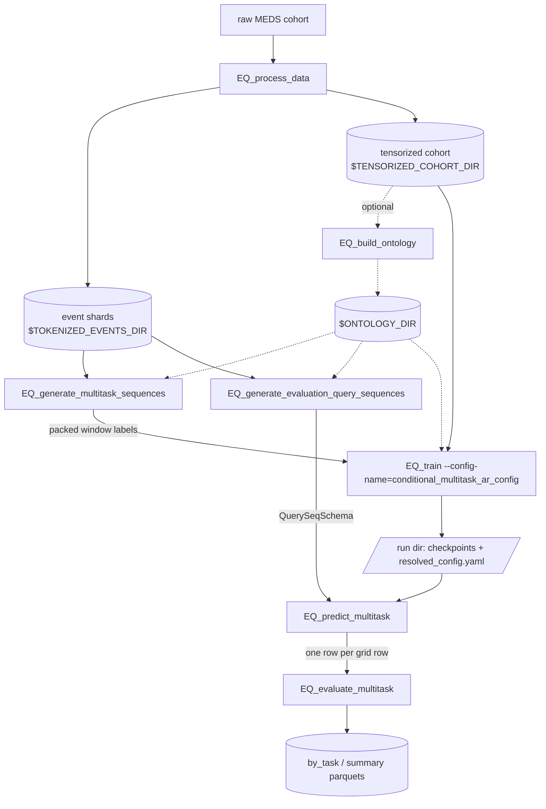

# EveryQuery — conditional multitask queries

[](https://github.com/payalchandak/EveryQuery/actions/workflows/tests.yaml)
[](https://www.python.org)
[](https://lightning.ai)
[](https://hydra.cc)
[](LICENSE)

Given a [MEDS](https://github.com/Medical-Event-Data-Standard) dataset, EveryQuery trains a model
that answers arbitrary questions about a patient's future from the record so far:

> *Given the record up to time $t$, will code $c$ occur inside the window $(s, e)$?*

This fork adds **EQ-multitask** (`ConditionalMultitaskARModel`): a decoder-only model that answers
an ordered sequence of such questions in a single forward pass, for **every code in the vocabulary
at once**. One Llama backbone reads the tokenized patient stream and then a short sequence of
*window* tokens:

```
[patient events, W0, C0, A0, W1, C1, A1, W2]
```

`W_i` describes window `i`'s start and its end. That token's hidden state is projected back onto
the backbone's own input-embedding table, so one window yields one logit per vocabulary code — the
model is trained against every code at every window rather than against a sampled query. Between
windows sit a conditioning code `C_i` and its teacher-forced answer `A_i`, so a later window is
answered conditioned on the patient state **and** on what was observed in the earlier ones.

A window is more than a horizon. It **opens** at the prediction time, after a delay, or at the next
occurrence of a start event; it **closes** a number of days after that resolved start, or at the
next occurrence of a bound event. Both endpoints are open, the end is always measured from the
*resolved* start, and a start event that never occurs leaves the window empty.

Censoring is not a label class — it is a query on the real end-of-record code `TIMELINE//END`
(`(TIMELINE//END, 30)` answered YES means "the record ends within 30 days"), so a later window can
be conditioned on it. With an ontology, a window can be started, bounded or conditioned by a whole
**code family** ("until the next `LAB//220645//*`"), and an ancestor's answer is the OR of its
descendants'.

[`docs/MULTITASK.md`](docs/MULTITASK.md) is the design doc: window semantics, censoring-as-a-query,
ontology queries, and why the evaluator macro-averages over task specs instead of pooling.

**Two pipelines ship in this tree.** *EQ-multitask* is the one the walkthrough below covers.
*EQ-single* — the original upstream single-query model — is here unchanged and fully supported; see
[The upstream single-query pipeline](#the-upstream-single-query-pipeline).

## Install

```bash
uv sync --group dev # from a checkout
# or
pip install EveryQuery
```

Every CLI below is a Hydra entry point: override any knob with `key=value`, add one with
`+key=value`, and print the resolved config with `--cfg job`. Path arguments are required
(`???` in the YAML) — there is no env-var fallback. `env.example.sh` lists the path variables used
below (add a `MULTITASK_TASKS_DIR` for the multitask label root); copy it to `env.sh`, edit, and
`source env.sh` so they expand into the commands.

## Pipeline



### 1. Preprocess — `EQ_process_data`

```bash
EQ_process_data \
	input_dir="$DATA_DIR" \
	intermediate_dir="$TOKENIZED_EVENTS_DIR" \
	output_dir="$TENSORIZED_COHORT_DIR"
```

| Arg                | Meaning                                                                               |
| ------------------ | ------------------------------------------------------------------------------------- |
| `input_dir`        | raw MEDS cohort root (`data/{split}/*.parquet`, `metadata/codes.parquet`)             |
| `intermediate_dir` | MEDS-transforms staging; the string-coded event shards the samplers read              |
| `output_dir`       | tensorized cohort for training; `metadata/codes.parquet` here is the model vocabulary |
| `do_reshard=true`  | reshard the input first (default `false`)                                             |

### 2. (Optional) Build an ontology — `EQ_build_ontology`

```bash
EQ_build_ontology \
	tensorized_cohort_dir="$TENSORIZED_COHORT_DIR" \
	out_dir="$ONTOLOGY_DIR" \
	decay=0.5 \
	subtree_suffix=ANY
```

Run once per cohort. See [How the ontology works](#how-the-ontology-works). Every later step takes
`ontology_dir=$ONTOLOGY_DIR`; skip it everywhere (default `null`) to work with leaf codes only.
**The same directory must be used for generation, training and evaluation** — ancestor token
indices are assigned by the build, so mixing ontologies addresses the wrong embedding rows. The
checkpoint records the cohort's vocabulary fingerprint, so an ontology built from a *different*
cohort of the same width is refused rather than silently accepted.

### 3. Generate training labels — `EQ_generate_multitask_sequences`

```bash
EQ_generate_multitask_sequences \
	data_dir="$TOKENIZED_EVENTS_DIR" \
	out_dir="$MULTITASK_TASKS_DIR" \
	query_codes="$TENSORIZED_COHORT_DIR" \
	split=train \
	num_training_examples=10000000 \
	num_bounds=5 \
	ontology_dir="$ONTOLOGY_DIR" # omit for leaf codes only
```

Samples `num_training_examples` random `(subject, prediction_time)` contexts across the whole
split, draws a fixed sequence of `num_bounds` windows for each, and labels **every** base-vocabulary
code at **every** window. Run it for `split=train` and `split=tuning` (training validates on
`tuning`). Output, per event shard:

```
{out_dir}/{split}/{shard}.parquet          MultitaskBoundarySchema metadata, one row per context
{out_dir}/{split}/{shard}.labels.npy       uint8 (rows, K, ceil(V/8)), little bit order, row-aligned
{out_dir}/{split}/_multitask_manifest.json vocabulary + window semantics the bits were built under
```

| Knob                                                          | Default                           | Meaning                                                                                                                                                                                                                          |
| ------------------------------------------------------------- | --------------------------------- | -------------------------------------------------------------------------------------------------------------------------------------------------------------------------------------------------------------------------------- |
| `query_codes`                                                 | required                          | the cohort's vocabulary: a tensorized-cohort root (reads `metadata/codes.parquet`) or a direct `codes.parquet` path. Bits align to its unchanged `code/vocab_index`; an inline code list is refused, since it carries no indices |
| `num_training_examples`                                       | 10000000                          | contexts drawn across the whole split (global budget, not per shard); one context is one output row                                                                                                                              |
| `num_bounds`                                                  | 5                                 | windows per context — fixed, not sampled, and the `K` the model's `max_windows` must cover                                                                                                                                       |
| `duration_min` / `duration_max` / `duration_distribution`     | 1 / 1826 / `log-uniform`          | end-horizon draw, continuous days **after the resolved start**                                                                                                                                                                   |
| `eventbound_fraction`                                         | 0.5                               | per slot, the probability the window ends at the next occurrence of a boundary code instead of after a horizon                                                                                                                   |
| `eventstart_fraction` / `prediction_time_start_fraction`      | 0.2 / 0.4                         | how the start is drawn: event-defined / the prediction time itself / (the remainder) a positive delay                                                                                                                            |
| `start_duration_min` / `_max` / `_distribution`               | 1 / 180 / `log-uniform`           | the positive start-delay draw, in days after the prediction time                                                                                                                                                                 |
| `code_weighting` / `code_weight_column` / `code_weight_power` | null / `code/n_occurrences` / 1.0 | `prevalence` draws boundary and start codes ∝ the weight column instead of uniformly, so most windows actually close                                                                                                             |
| `exclude_boundary_prefixes`                                   | `[]`                              | prefixes dropped from the boundary and start pools (never from the targets); `TIMELINE//DELTA` is the usual entry                                                                                                                |
| `min_prediction_times_per_subject`                            | 50                                | eligibility threshold for a prediction time                                                                                                                                                                                      |
| `ontology_dir` / `ontology_mode`                              | null / null                       | lets an ancestor node start, bound or condition a window; `boundaries+conditions` once `ontology_dir` is set                                                                                                                     |
| `max_workers` / `label_chunk_rows`                            | cores / 2000                      | shard-labeling parallelism and per-worker scratch (raise → more RAM)                                                                                                                                                             |
| `seed`                                                        | 1                                 | per-shard seeds also mix in the shard id, so no two shards draw the same windows                                                                                                                                                 |

Targets are **always** the cohort's leaf codes: an ontology never widens the label bits. An
ancestor's bit is exactly the OR of its descendant leaves' bits under the window rule, so the model
derives it per batch from these leaf sidecars rather than storing it. Intermediates (prediction-time
map, window index, per-shard provenance) land in the sibling `{out_dir}_artifacts/`; `out_dir` holds
final parquets and sidecars only.

### 4. Generate the evaluation grid — `EQ_generate_evaluation_query_sequences`

> **The name says "query sequences", but this is the evaluation-grid generator for the *multitask*
> model.** `EQ_predict_multitask` reads exactly its output, and it is the only generator that can
> emit the explicit window starts the multitask model consumes.

It labels the **same** `N` query specifications at every evaluation context, so metrics are
comparable spec-for-spec across cohorts — which is what makes the per-spec grouping in step 7
possible. Two ways to choose the specs:

**a) Sampled from the training distribution:**

```bash
EQ_generate_evaluation_query_sequences \
	data_dir="$TOKENIZED_EVENTS_DIR" \
	out_dir="$EVAL_SEQ_TASKS_DIR" \
	query_codes="$TENSORIZED_COHORT_DIR" \
	split=held_out \
	prediction_times_per_subject=1 \
	num_evaluation_sequences=64 \
	ontology_dir="$ONTOLOGY_DIR"
```

**b) Designed specs** via `sequences_path=` — nothing is sampled, `query_codes` only validates the
vocabulary:

```yaml
# designed.yaml   name -> [entry, ...]
mortality_30d_uncensored:
  - [TIMELINE//END, 30]      # condition on "record continues past 30d"
  - [MEDS_DEATH, 30]
sepsis_before_discharge:
  - [SEPSIS, -1, HOSPITAL_DISCHARGE//HOME]
lab_in_the_month_after_admission:
  - query: LAB//220645//ANY  # ancestor query (needs ontology_dir)
    start_event: HOSPITAL_ADMISSION
    duration_days: 30
```

```bash
EQ_generate_evaluation_query_sequences ... sequences_path=designed.yaml
```

An entry is `[code, duration_days]`, `[code, -1, bound_event]`, or the mapping form
`{query, duration_days[, bound_event][, start_duration_days][, start_event]}` — the mapping is the
readable one for a window that opens later than the prediction time. A long-format parquet
`(seq_id, position, query, duration_days[, bound_event][, start_duration_days][, start_event])`
works too.

| Knob                                                       | Default                  | Meaning                                                                                                                                                           |
| ---------------------------------------------------------- | ------------------------ | ----------------------------------------------------------------------------------------------------------------------------------------------------------------- |
| `num_evaluation_sequences`                                 | 64                       | how many specs to draw. Drawn once, seeded on `(seed, "eval_seq_specs", split)` alone and shared by every context                                                 |
| `min_queries` / `max_queries`                              | 1 / 1                    | queries per spec. At 1 there is no conditioning; raise both to give each grid row teacher-forced prior answers                                                    |
| `prediction_times_per_subject` / `min_context_per_subject` | 1 / 50                   | the cohort: contexts per subject, and prior events a subject needs first                                                                                          |
| `subject_subsample_fraction`                               | null                     | deterministic per-subject hash filter, so the fraction holds regardless of shard size                                                                             |
| `contexts_path`                                            | null                     | a parquet of `(subject_id, prediction_time)` labeled verbatim (e.g. 24h-post-admission anchors), overriding the three knobs above                                 |
| `eventstart_fraction` / `prediction_time_start_fraction`   | 0.0 / 1.0                | as in step 3. The defaults open every sampled window at the prediction time and emit no start columns                                                             |
| `duration_min` / `duration_max` / `duration_distribution`  | 1 / 1826 / `log-uniform` | keep identical to the training sampler's: drift does not raise, it puts the grid out of distribution and reads as an unexplained metric shift                     |
| `eventbound_fraction`                                      | 0.5                      | as in step 3; ignored when `sequences_path` is set                                                                                                                |
| `ontology_dir`                                             | null                     | puts ancestor nodes into the query and boundary universe and explodes the event stream through the closure so an ancestor query is labeled by ordinary occurrence |

The sampling knobs mirror step 3; pass the same overrides you trained with, or the grid is silently
out of distribution.

Output: `{out_dir}/eval/{split}/{shard}.parquet` in `QuerySeqSchema` (pass `{out_dir}/eval` to
predict — never `out_dir` itself) plus the deduplicated contexts under `{out_dir}/eval_unique/`. Use
a different `out_dir` from the single-query `EQ_generate_evaluation_tasks`: they share the layout
but not the schema.

### 5. Train — `EQ_train --config-name=conditional_multitask_ar_config`

```bash
EQ_train --config-name=conditional_multitask_ar_config \
	output_dir="$TRAINING_OUTPUT_DIR" \
	datamodule.config.tensorized_cohort_dir="$TENSORIZED_COHORT_DIR" \
	datamodule.config.task_labels_dir="$MULTITASK_TASKS_DIR" \
	lightning_module.model.ontology_dir="$ONTOLOGY_DIR" # omit for leaf codes only
```

Each launch lands in `{output_dir}/<date>/<time>/` with `checkpoints/`, `resolved_config.yaml` and
the logger's output under `loggers/` — that run dir is what `EQ_predict_multitask` consumes. The
shipped config logs to Weights & Biases, so either set `WANDB_ENTITY` (or pass
`trainer.logger.entity=…`), or run without it: `trainer.logger=false` for no logging, or swap in a
`CSVLogger` as `src/every_query/train/README.md` describes. Vocabulary size
and max positions are sized from the cohort (or from the ontology's extended vocabulary)
automatically, and both widths are recorded in the checkpoint.

Common overrides (full list:
`src/every_query/train/configs/conditional_multitask_ar_config.yaml`):

| Knob                                                        | Default                                                         |
| ----------------------------------------------------------- | --------------------------------------------------------------- |
| `datamodule.batch_size` / `datamodule.num_workers`          | 96 / 8                                                          |
| `datamodule.config.max_seq_len`                             | 256 patient tokens                                              |
| `datamodule.eval_tasks_dir`                                 | null — an optional step-4 `eval/` root; `fit` never reads it    |
| `lightning_module.model.max_windows`                        | 5 (must be ≥ the labels' `num_bounds`)                          |
| `lightning_module.model.use_rope_time`                      | true — elapsed hours as rotary positions, delta tokens stripped |
| `lightning_module.model.config_overrides.num_hidden_layers` | 12 (hidden 384, 6 heads, intermediate 1536)                     |
| `lightning_module.optimizer.lr` / `lightning_module.warmup_ratio` | 2e-4 / 0.05                                               |
| `trainer.max_epochs` / `trainer.precision`                  | 1 / `bf16-mixed`                                                |
| `do_resume=true`                                            | resume the run in `output_dir` (mid-epoch, stateful loader)     |
| `seed`                                                      | 140799                                                          |

Checkpointing and early stopping monitor `tuning/loss`. `ontology_dir` is set once on the model;
the datamodule interpolates it.

### 6. Predict — `EQ_predict_multitask`

```bash
EQ_predict_multitask \
	model_run_dir="$TRAINING_OUTPUT_DIR/YYYY-MM-DD/HH-MM-SS" \
	tasks_dir="$EVAL_SEQ_TASKS_DIR/eval" \
	output_parquet="$TRAINING_OUTPUT_DIR/predictions.parquet" \
	split=held_out
```

Scores each grid row's **final** query — conditioned on the patient and on the earlier queries with
their true answers — and writes one row per grid row, in grid order:

```
subject_id, prediction_time,
queries, start_durations, start_events, durations, bound_events, answers,
target_code, label, prob
```

`target_code` is `queries[-1]` and `label` is `answers[-1]`; the final query is never teacher-forced
into its own prediction. Options: `ckpt_name=` (checkpoint stem under `checkpoints/`, default best),
`batch_size=`, `num_workers=`, `device=` (`cpu`, `cuda`, `cuda:N`, `mps`), `precision=` (default
`bf16-mixed`, matching every shipped training config), `enable_progress_bar=false` for log-file
runs, `overwrite=true`. `split=train` is refused.

Prediction is **single-device and single-process** by construction: rows are concatenated in loader
order and must stay aligned with the grid, so a multi-device trainer or a `torchrun` /
`srun --ntasks>1` launch is refused rather than sharded. Launch one process.

### 7. Evaluate — `EQ_evaluate_multitask`

```bash
EQ_evaluate_multitask \
	predictions_parquet="$TRAINING_OUTPUT_DIR/predictions.parquet" \
	metrics_stem="$TRAINING_OUTPUT_DIR/metrics"
```

Groups the prediction rows by the query **specification** — the five list columns `queries`,
`durations`, `start_durations`, `start_events`, `bound_events` — which recovers exactly the `N`
specs step 4 resolved, each populated by the whole cohort. It writes two tables:

- `metrics.by_task.parquet`, one row per spec: the spec itself, a descriptive `target_code` /
  `n_queries` / `duration_bucket`, `n_rows` / `n_positive` / `prevalence`, `n_subjects`, the
  within-cell `auroc` (null when the cell is single-class) and its 95% subject-cluster bootstrap
  interval `auroc_ci_lo` / `auroc_ci_hi`.
- `metrics.summary.parquet`, exactly one row: `macro_auroc` — the mean over the scorable cells —
  with three 95% intervals, `macro_auroc_ci_{lo,hi}_tasks`, `_subjects` and `_nested`, plus
  `n_tasks_scored`, `n_tasks_null`, `n_resamples` and `bootstrap_seed`.

**Quote `_nested` as the headline uncertainty.** It is the only one of the three that resamples both
axes — patients *and* task specs. `_subjects` holds the `N` specs fixed and sees patient noise
alone; `_tasks` treats each cell's AUROC as exact and sees between-task spread alone (it is kept
because it is the form `upstream/task-auroc-ci` adds to the training-time callback — that branch has
not landed, so the callback in this tree still logs a point estimate only).

`n_tasks_null` is reported next to `macro_auroc` for a reason: AUROC is undefined on a single-class
cell, so a macro over 12 of 64 cells must not be readable as a macro over 64. The only knob is
`n_resamples` (default 1000) — the intervals themselves are not optional.

> Report **macro (per-spec) AUROC, not AUROC pooled over specs.** Pooled AUROC scores cross-query
> pairs and is inflated by base-rate differences between queries; it measures cross-query
> separation, not within-task skill. This is exactly why the evaluator groups instead of pooling —
> see [`docs/MULTITASK.md`](docs/MULTITASK.md) §4.

## The upstream single-query pipeline

The original EveryQuery model ships here unchanged: it asks **one** query at a time — *will code `c`
occur within `d` days of `t`?* — over a bidirectional encoder, and it is the right starting point if
you want the simpler model, a baseline to compare against, or the code the upstream project
maintains. It shares `EQ_process_data` with the walkthrough above and then runs its own four steps:

```bash
EQ_generate_training_tasks \
	data_dir="$TOKENIZED_EVENTS_DIR" out_dir="$TRAINING_TASKS_DIR" \
	query_codes="$TENSORIZED_COHORT_DIR" split=train

EQ_generate_evaluation_tasks \
	data_dir="$TOKENIZED_EVENTS_DIR" out_dir="$EVAL_TASKS_DIR" \
	query_codes="$TENSORIZED_COHORT_DIR" split=held_out

EQ_train \
	output_dir="$TRAINING_OUTPUT_DIR" \
	datamodule.config.tensorized_cohort_dir="$TENSORIZED_COHORT_DIR" \
	datamodule.config.task_labels_dir="$TRAINING_TASKS_DIR"

EQ_predict \
	model_run_dir="$TRAINING_OUTPUT_DIR/YYYY-MM-DD/HH-MM-SS" \
	tasks_dir="$EVAL_TASKS_DIR/eval" \
	output_parquet="$TRAINING_OUTPUT_DIR/predictions.parquet" split=held_out

EQ_evaluate \
	predictions_parquet="$TRAINING_OUTPUT_DIR/predictions.parquet" \
	metrics_parquet="$TRAINING_OUTPUT_DIR/metrics.parquet"
```

`EQ_train` with no `--config-name` is the single-query config (`train/configs/config.yaml`).
`EQ_sample_task_tracking_pairs` builds the tracking pairs used for query-embedding diagnostics, and
`predict/external_tasks/` converts ACES task definitions into this pipeline's inputs.

The two pipelines are independent from step 3 onward and their label roots are **not**
interchangeable: `EQ_generate_training_tasks` and `EQ_generate_evaluation_tasks` write flat
`TaskQuerySchema` rows, while the multitask steps write packed window labels and `QuerySeqSchema`
grids. Both evaluation generators write `eval/{split}/{shard}.parquet`, so give them different
`out_dir` roots.

## How the ontology works

MEDS code names are already a hierarchy: `LAB//A//mEq/L//value_[5,13)` sits under
`LAB//A//mEq/L`, under `LAB//A`, under `LAB`. `EQ_build_ontology` reads the cohort's
`metadata/codes.parquet` (plus an explicit `parent_codes` column if present) and turns every
`//`-prefix into a DAG node:


Rectangles are observed leaf codes (they appear in patient streams and keep their cohort token
ids); rounded nodes are ancestors minted by the build (fresh ids above the highest leaf). A query
on `LAB//A` is answered YES if *any* of its descendants occurs. A name that is both a real code and
a parent (`INFUSION_START//X`) keeps its exact meaning and gets a `//ANY` sibling for the subtree
meaning. The build writes three parquets to `out_dir`:

| File                           | Contents                                                                                                                                                         |
| ------------------------------ | ---------------------------------------------------------------------------------------------------------------------------------------------------------------- |
| `ontology_vocab.parquet`       | `(node_name, token_id, is_observed_code)` — the extended vocabulary. Leaf codes keep their cohort indices; ancestor nodes get fresh ones above the highest leaf. |
| `embedding_mix.parquet`        | sparse $A$ with entry $\text{decay}^{\,\text{distance}}$ for each (node, ancestor) pair plus a self-loop                                                         |
| `event_to_query_nodes.parquet` | `(event_code, query_node)` closure: every leaf paired with itself and each ancestor it satisfies                                                                 |

Setting `ontology_dir` does two things:

1. **Ancestors become addressable.** The multitask sampler lets an ancestor node start, bound or
    condition a window (`ontology_mode`), and the evaluation-grid generator adds every ancestor to
    the query and boundary universe, labeling an ancestor query by exploding the event stream
    through the closure — "did any descendant occur?". Ancestor *targets* need no sampler support at
    all: under the window rule an ancestor's bit is the OR of its descendant leaves' bits, so the
    model derives it per batch from the leaf-only sidecars.
2. **Embeddings are ontology-mixed.** The backbone's input embedding becomes $(A W)[\text{ids}]$:
    each code's vector is the row-normalised weighted average of its own row and its ancestors'. A
    rare leaf is pulled toward its better-estimated parents, and an ancestor node (never seen in a
    patient stream) still gets gradient through its descendants. The multitask readout projects onto
    that same mixed table, so an ancestor is an ordinary code on both sides. `decay=0` keeps the
    structure with no mixing.

**Dual-role names.** A name that is both a real code and another code's prefix (e.g.
`INFUSION_START//X` is an unvalued event *and* the parent of its `//value_[…)` bins) gets a
sibling subtree node `INFUSION_START//X//ANY` meaning "this code or any descendant"; the bare name
stays exact. `subtree_suffix=null` disables this.

## Development

```bash
uv run pytest                                                          # full suite minus slow tests
uv run pytest -m "slow or not slow"                                    # including the heavy end-to-end runs
uv run pytest tests/multitask tests/test_conditional_multitask_cli.py  # this pipeline
uv run pytest tests/test_cli_smoke.py                                  # every EQ_* --help exits 0
uv run pre-commit run --all-files                                      # ruff, mdformat, codespell
```

`tests/test_conditional_multitask_cli.py` runs the full generate → train → predict chain on a
fixture cohort, and `tests/test_evaluate_multitask.py` pins the evaluator's grouping and bootstrap.
`pytest` runs with `--doctest-modules --doctest-glob=*.md`, so code examples in docstrings and
Markdown execute as tests.

[`CONTRIBUTING.md`](CONTRIBUTING.md) covers the shared-venv trap that makes an ad-hoc script in a
worktree import the *main* checkout's code, and [`tests/README.md`](tests/README.md) covers the
suite's layout and why the feature tests are shaped the way they are.

## Acknowledgements

Built on [MEDS](https://github.com/Medical-Event-Data-Standard),
[`meds-torch-data`](https://github.com/mmcdermott/meds-torch-data),
[`MEDS-transforms`](https://github.com/mmcdermott/MEDS_transforms), and
[`MEDS_EIC_AR`](https://github.com/mmcdermott/MEDS_EIC_AR); uses [Hydra](https://hydra.cc),
[PyTorch Lightning](https://lightning.ai) and [W&B](https://wandb.ai).

## License

MIT — see [LICENSE](LICENSE).
