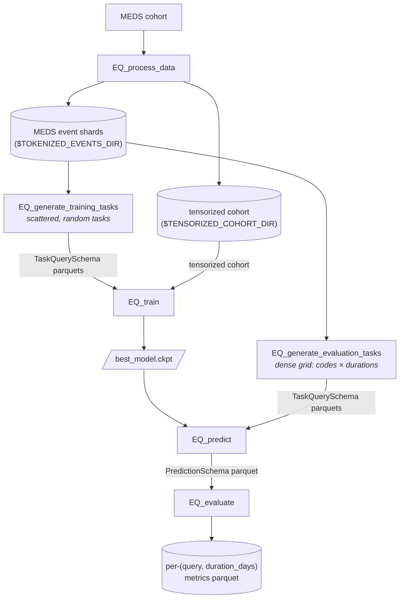
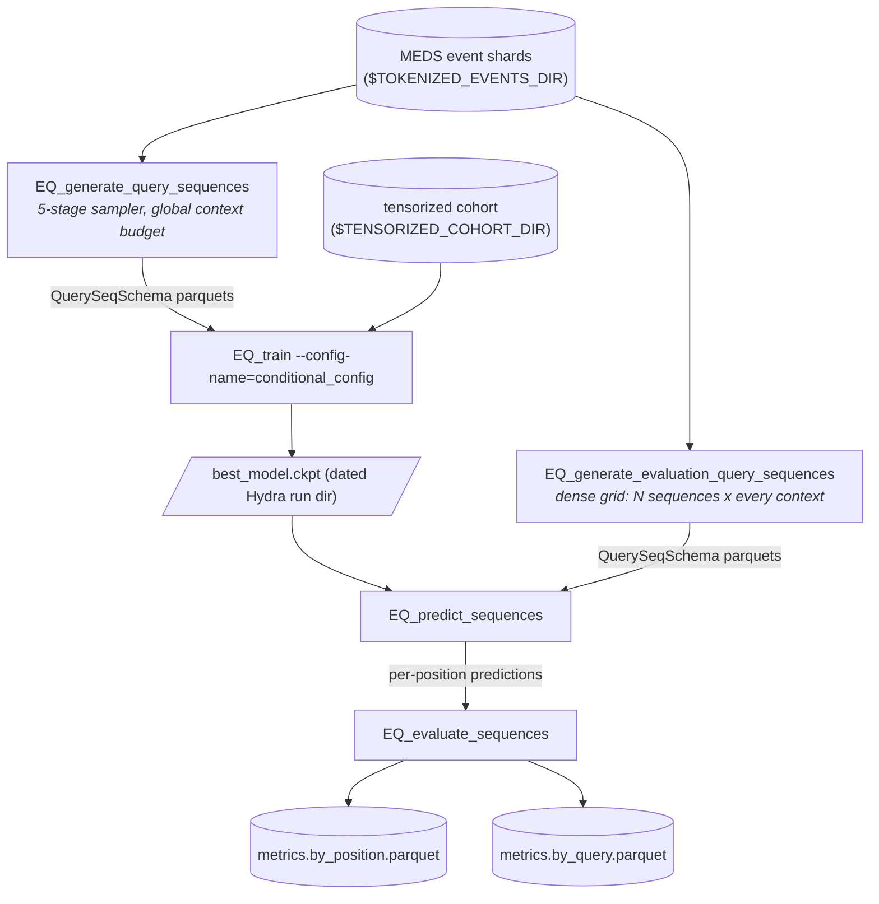

# EveryQuery

[](https://github.com/payalchandak/EveryQuery/actions/workflows/tests.yaml)
[](https://codecov.io/gh/payalchandak/EveryQuery)
[](https://www.python.org)
[](https://lightning.ai)
[](https://hydra.cc)
[](LICENSE)

Given a MEDS dataset, EveryQuery trains a ModernBERT-style encoder to answer
"query" prediction tasks of the form: *given a subject's history up to time `t`, will code
`c` occur within `d` days?* The same trained model is then evaluated against arbitrary
`(code, duration)` combinations.

EveryQuery is built on the [MEDS](https://github.com/Medical-Event-Data-Standard) ecosystem leveraging [`meds-torch-data`](https://github.com/mmcdermott/meds-torch-data) for tensorization and [`MEDS-transforms`](https://github.com/mmcdermott/MEDS_transforms) for preprocessing.

> [!IMPORTANT]
> **This fork (`conditional-v2` branch) adds a conditional query-sequence model** — a
> bidirectional patient encoder + block-autoregressive decoder that answers an ordered list of
> queries, each conditioned on the patient state and the teacher-forced answers of all earlier
> queries. Binary observed-occurrence labels; censoring is expressed by querying the real
> `TIMELINE//END` code rather than via a separate head. See
> **[CONDITIONAL_QUERIES.md](CONDITIONAL_QUERIES.md)** for the design, the macro per-task
> evaluation methodology, and results, and
> [**Conditional query sequences**](#conditional-query-sequences) below for the end-to-end commands.
>
> The conditional pipeline has been ported onto upstream's 5-stage sampler: contexts are now drawn
> globally across a split and durations are unrounded floats, so **a checkpoint trained before the
> port must be retrained** — see
> [Migrating from the pre-port sampler](#migrating-from-the-pre-port-sampler).

## Install

**As a dependency:**

```bash
pip install EveryQuery
```

## Repository layout

Every production module lives under a submodule that reflects its role:

```
src/every_query/
├── preprocessing/      → EQ_process_data        (raw MEDS → tensorized cohort)
├── generate_tasks/     → EQ_generate_training_tasks + EQ_generate_evaluation_tasks + EQ_sample_task_tracking_pairs (TaskQuerySchema parquets: scattered for PT, dense for eval, pos/neg pairs for in-training AUROC)
├── train/              → EQ_train               (train the model)
├── predict/            → EQ_predict             (inference; consumes TaskQuerySchema, emits PredictionSchema)
│   └── external_tasks/                         (ACES + composite aggregation — currently `python -m` only;
│                                                  [#62](https://github.com/payalchandak/EveryQuery/issues/62) tracks promoting to console scripts, draft PR [#95](https://github.com/payalchandak/EveryQuery/pull/95))
├── evaluate/           → EQ_evaluate           (metrics on a PredictionSchema parquet)
├── model/              (shared: nn.Module + LightningModule)
├── data/               (shared: PyTorch Dataset + Batch types + TaskQuerySchema)
└── utils/              (helpers: seeds, code slugs, env-var validation, model_loader)
```

Every submodule has its own `README.md` explaining what belongs there, its pipeline
position, and the tracking issues for remaining work.

Research-only, paper-specific code (ID/OOD code sampling, ablations, the results notebook,
figure code, the ETHOS comparison) lives in the separate `EveryQueryExperiments` repo, which
depends on `EveryQuery` as an installed library. The split is tracked in
[#186](https://github.com/payalchandak/EveryQuery/issues/186).

## Console scripts

`pip install` exposes the CLIs below, all Hydra-configurable. Run any with `--help` or
`--cfg job` to inspect the resolved config. The **Tests** column summarises the coverage
that lands with each CLI on `dev` today — unit tests (fast, `tests/test_<name>_logic.py`
or `tests/test_<module>.py`), CLI smoke tests (`tests/test_cli_smoke.py`, `--help`-exits-0),
and end-to-end subprocess tests that run the real script against a fixture cohort.

| Script                          | Stage            | Purpose                                                                                                                 | Tests                                                                                                                    |
| ------------------------------- | ---------------- | ----------------------------------------------------------------------------------------------------------------------- | ------------------------------------------------------------------------------------------------------------------------ |
| `EQ_process_data`               | preprocessing    | Orchestrate MEDS-transforms + `meds-torch-data` tensorization                                                           | smoke; E2E via `test_process_data.py` + `test_e2e_foundation.py`                                                         |
| `EQ_generate_training_tasks`    | PT task labels   | Sample `N` tasks × `M` contexts (scattered `(query, duration_days)`), label via single-pass asof                        | smoke; unit `tests/sampler/`; E2E `test_generate_tasks.py`                                                               |
| `EQ_generate_evaluation_tasks`  | eval task labels | Sample `K` prediction times per subject, cross-join with `(codes × durations)` grid for dense evaluation shape          | smoke; E2E `test_generate_evaluation_tasks_cli.py`                                                                       |
| `EQ_sample_task_tracking_pairs` | AUROC tracking   | Sample one pos + one neg row per `(query, duration_days)` from the dense eval labels for cheap in-training AUROC        | smoke; E2E `test_sample_task_tracking_pairs_cli.py`                                                                      |
| `EQ_train`                      | training         | Train the ModernBERT encoder on the labeled tasks                                                                       | smoke; unit `test_training.py`; E2E `test_train_cli.py` + `test_train.py`; signal test `tests/training_validity/` (slow) |
| `EQ_predict`                    | inference        | Consume a `TaskQuerySchema` parquet dir + checkpoint, emit a `PredictionSchema` parquet (`censor_prob`, `occurs_prob`)  | smoke; E2E `test_predict_cli.py` (row-order preserved); exercised by `tests/training_validity/` (slow)                   |
| `EQ_evaluate`                   | metrics          | Consume a `PredictionSchema` parquet, write per-`(query, duration_days)` metrics (`occurs_auroc`, `censor_auroc`, etc.) | smoke; E2E `test_evaluate_cli.py`; exercised by `tests/training_validity/` (slow)                                        |

The conditional query-sequence pipeline (this fork) adds a parallel set of CLIs that consume and
emit `QuerySeqSchema` rather than `TaskQuerySchema` — see
[CONDITIONAL_QUERIES.md](CONDITIONAL_QUERIES.md):

| Script                                   | Stage           | Purpose                                                                                                                                                                                       | Tests                                                                              |
| ---------------------------------------- | --------------- | --------------------------------------------------------------------------------------------------------------------------------------------------------------------------------------------- | ---------------------------------------------------------------------------------- |
| `EQ_generate_query_sequences`            | PT seq labels   | Sample a variable-length query sequence per `(subject, prediction_time)` context and label each query by observed occurrence; contexts come from the 5-stage sampler, or from `contexts_path` | `test_conditional_cli.py`; unit `test_conditional_queries.py`                      |
| `EQ_generate_evaluation_query_sequences` | eval seq labels | Dense grid: label the same `N` query sequences at every context of one cohort — cohort and sequences are each either supplied (`contexts_path` / `sequences_path`) or sampled                 | `test_conditional_cli.py`; unit `tests/sampler/test_eval_grid_sampled_contexts.py` |
| `EQ_predict_sequences`                   | inference       | Consume `QuerySeqSchema` + a conditional checkpoint, emit one row per query position with `answer_prob`                                                                                       | `test_conditional_cli.py`                                                          |
| `EQ_evaluate_sequences`                  | metrics         | Write `<stem>.by_position.parquet` + `<stem>.by_query.parquet` from the per-position predictions                                                                                              | `test_conditional_cli.py`                                                          |

The legacy four-stage evaluator (`every_query.evaluate.eval`, with `gen_index_times`, `gen_task`, `select_model` siblings) has been deleted; recover from git history if needed. [#83](https://github.com/payalchandak/EveryQuery/issues/83) tracks the cross-model leaderboard, which now lives in the `EveryQueryExperiments` repo.

## Pipeline

### Single-query pipeline



Both task-generation endpoints emit `TaskQuerySchema`-conformant parquets. Training uses the scattered shape (one random `(query, duration_days)` per row); evaluation uses the dense shape (every held-out `(subject, time)` × every `(query × duration)` the user wants metrics for) so `EQ_predict` + `EQ_evaluate` cover a full grid without having to run inference twice.

### 1. Preprocess

```bash
EQ_process_data \
	input_dir="$DATA_DIR" \
	intermediate_dir="$TOKENIZED_EVENTS_DIR" \
	output_dir="$TENSORIZED_COHORT_DIR"
```

Produces a tensorized MEDS cohort under `$TENSORIZED_COHORT_DIR`. `$TOKENIZED_EVENTS_DIR` is a staging
directory for the MEDS-transforms stages; `$TENSORIZED_COHORT_DIR` holds cross-shard metadata
(`$TENSORIZED_COHORT_DIR/metadata/codes.parquet` is the query-code universe the sampler draws from).

### 2a. Generate pre-training task labels

```bash
EQ_generate_training_tasks \
	split=train \
	num_queries=4000000 \
	num_contexts_per_query=1 \
	max_workers=1 \
	data_dir="$TOKENIZED_EVENTS_DIR" \
	out_dir="$TRAINING_TASKS_DIR" \
	query_codes="$TENSORIZED_COHORT_DIR"
```

`data_dir` is the MEDS dataset root (event shards read from `{data_dir}/data/{split}/*.parquet`) and `out_dir` is the final-dataset root. Both are required Hydra args (no `.env` fallback — see [#235](https://github.com/payalchandak/EveryQuery/issues/235)); pass them as shell-expanded vars after `source env.sh`.

One command runs the whole 5-stage sampler in a single process (Stages 0–3 inline, then Stage 4 labels shards in parallel). The dataset lands at `$TRAINING_TASKS_DIR/{split}/{shard}.parquet`, with intermediates in the sibling `*_artifacts` dir (see [`generate_tasks/README.md`](src/every_query/generate_tasks/README.md)). Columns conform to [`TaskQuerySchema`](src/every_query/data/schema.py) — `subject_id, prediction_time, query, duration_days, boolean_value` — where `boolean_value` is three-valued: `True` (query code occurs in `(prediction_time, prediction_time + duration_days]`), `False` (window fully observed, no occurrence), or `null` (censored — window extends past the subject's last recorded time).

> `max_workers` sets how many shards are labeled in parallel, so raising it raises peak RAM. If Stage 4 OOMs, set `max_workers=1`.

> **Note:** The total number of training samples generated will be `num_queries * num_contexts_per_query`

`query_codes=` is required for training. Set it to a metadata root (`query_codes=$TENSORIZED_COHORT_DIR`) to
sample from `{dir}/metadata/codes.parquet`, or to an inline list / YAML path to restrict which codes
can be sampled as queries. YAML files may be a flat list or a mapping with a `codes:` key. This does
not remove codes from patient histories.

```bash
EQ_generate_training_tasks query_codes=/path/to/train_query_codes.yaml …
```

```yaml
# train_query_codes.yaml
codes:
  - HR
  - TEMP
```

### 2b. Generate evaluation task labels

```bash
EQ_generate_evaluation_tasks \
	split=held_out \
	prediction_times_per_subject=5 \
	'query_codes=[HR, TEMP]' \
	'durations=[1, 7, 30, 90, 365]' \
	data_dir="$TOKENIZED_EVENTS_DIR" \
	out_dir=$EVAL_TASKS_DIR
```

Samples `1` prediction times per subject by default, cross-joins with the full `(codes × durations)` grid, labels via the same primitive as training. Output lands under `$EVAL_TASKS_DIR/eval/{split}/*.parquet` (separate `eval/` subdir so it doesn't collide with the training-task output).

The endpoint discovers every shard under `{data_dir}/data/{split}/*.parquet` and processes them all in one invocation, writing one output parquet per shard — no shard counting, no `-m input_shard=...` sweep (removed in #279; passing `input_shard=` now fails as an unknown override). The prediction-time sampler is deterministic per shard in `(seed, input_shard, split)`, so outputs are identical to the old exhaustive sweep. Reruns skip shards whose outputs already exist unless `overwrite=true`.

As with training, `data_dir` / `out_dir` are required Hydra args (pass them as shell-expanded vars). `query_codes` is also required — it is the evaluation query universe.

`query_codes=` accepts an inline list (as above), a metadata root / `codes.parquet` path (`query_codes=$TENSORIZED_COHORT_DIR` reads `{dir}/metadata/codes.parquet`), or — for reproducible pre-sampled code universes kept out of git — a path to a YAML file. The YAML is either a bare list or a mapping with a `codes:` key:

```yaml
# sampled_codes.yaml
codes:
  - HR
  - TEMP
  - ICD//A01
```

```bash
EQ_generate_evaluation_tasks query_codes=/path/to/sampled_codes.yaml …
```

### 3. Train

```bash
EQ_train \
	datamodule.config.tensorized_cohort_dir="$TENSORIZED_COHORT_DIR" \
	datamodule.config.task_labels_dir="$TRAINING_TASKS_DIR" \
	output_dir="$TRAINING_OUTPUT_DIR"
```

- `output_dir` is a required Hydra arg that is a base path you supply with `output_dir=`, e.g. `=$TRAINING_OUTPUT_DIR`. Hydra appends `<YYYY-MM-DD>/<HH-MM-SS>` for per-run uniqueness.
- If you want to override more parameters for training refer to `src/every_query/train/configs/config.yaml`

#### Optional: in-training macro-AUROC tracking

`EQ_train` can log a cheap, macro-averaged per-task AUROC estimate every validation pass
(`tuning/occurs_auroc_macro_sampled`, plus `..._n_tasks` for how many tasks contributed) via
`TaskAurocTrackingCallback`. Instead of scoring the whole tuning split, it scores a fixed,
offline-sampled parquet of exactly one positive + one negative row per `(query, duration_days)`
task. Because a task's AUROC equals `P(score(pos) > score(neg))` for a random pos/neg pair, the
win/tie/loss on that one pair is an unbiased (high-variance) estimate; macro-averaging across
tasks gives macro AUROC at `O(n_tasks)` forward examples. It is **tracking-only** — it does not
affect `tuning/loss`-driven checkpointing or early stopping.

First sample the tracking pairs once from the dense **tuning**-split eval labels (output of
`EQ_generate_evaluation_tasks`):

```bash
EQ_sample_task_tracking_pairs \
	eval_labels_dir="$EVAL_TASKS_DIR/eval" \
	out_dir="$TASK_TRACKING_DIR" \
	split=tuning
# pairs land at $TASK_TRACKING_DIR/tuning/0.parquet
```

Then enable the callback via its Hydra config group and point `task_labels_dir` at
`$TASK_TRACKING_DIR`:

```bash
EQ_train +callbacks=task_auroc \
	++trainer.callbacks.task_auroc_tracking.config.task_labels_dir="$TASK_TRACKING_DIR"
```

`+callbacks=task_auroc` composes `configs/callbacks/task_auroc.yaml` into the callbacks list.
It is off by default — `config.yaml` ships `task_auroc_tracking: null`, and `values_as_list`
drops `None` entries, so a plain `EQ_train` (e.g. when EveryQuery is used as a dependency) runs
without it and without needing any tracking pairs. Notes:

- The split is locked to `tuning` on purpose — tracking mirrors `tuning/loss` checkpointing, so
    it is not configurable. Sample the pairs with `split=tuning`.
- Out-of-vocab query codes (not in the model vocab) are skipped at scoring; the callback warns at
    setup and you'll see a smaller `..._n_tasks`. An empty tracking set logs a warning and simply
    never logs the metric (training is unaffected).
- Under DDP it scores on rank 0 only (the tracking set is identical on every rank), and the
    parquet is read once at setup — re-sampling mid-run requires a restart.
- To disable it entirely, just omit `+callbacks=task_auroc` (the default). The mandatory
    `task_labels_dir: ???` only errors when the group is actually enabled.

### 4. Predict

```bash
EQ_predict \
	model_run_dir="$TRAINING_OUTPUT_DIR/YYYY-MM-DD/HH-MM-SS" \
	tasks_dir="$EVAL_TASKS_DIR/eval/held_out" \
	output_parquet="$TRAINING_OUTPUT_DIR/predictions.parquet" \
	split=held_out
```

Reads every `*.parquet` under `tasks_dir` (`TaskQuerySchema`-conformant), runs the checkpoint's `predict_step` over the chosen split, writes a single `PredictionSchema` parquet with `censor_prob` + `occurs_prob` per input row. See [`predict/README.md`](src/every_query/predict/README.md) for details.

### 5. Evaluate

```bash
EQ_evaluate \
	predictions_parquet="$TRAINING_OUTPUT_DIR/predictions.parquet" \
	metrics_parquet="$TRAINING_OUTPUT_DIR/metrics.parquet"
```

Per-`(query, duration_days)` metrics from the predictions parquet — `n_rows`, `n_occurs_labeled`, `n_positive`, `prevalence`, `occurs_auroc` (on non-censored rows), `censor_auroc`. See [`evaluate/README.md`](src/every_query/evaluate/README.md).

### Conditional query sequences



Both sequence endpoints emit [`QuerySeqSchema`](src/every_query/data/schema.py) rather than `TaskQuerySchema`: one row per `(subject_id, prediction_time)` context with three aligned list columns — `queries`, `durations` (float days), `answers`. Answers are binary and never null; censoring is carried by a `TIMELINE//END` query rather than by a null label. Both take the same three mandatory path args as the single-query samplers (`data_dir`, `out_dir`, `query_codes`, all `???` with no env fallback).

The examples below use `$SEQ_TASKS_DIR` / `$EVAL_SEQ_TASKS_DIR` as ad-hoc shell vars (they are not in `env.example.sh`). Keep them distinct from `$TRAINING_TASKS_DIR` / `$EVAL_TASKS_DIR` — the sequence and single-query samplers both write `{split}/{shard}.parquet`, so sharing one root would have them overwrite each other.

#### 1. Generate query-sequence labels

```bash
EQ_generate_query_sequences \
	split=train \
	num_sequences=4000000 \
	min_queries=1 \
	max_queries=5 \
	data_dir="$TOKENIZED_EVENTS_DIR" \
	out_dir="$SEQ_TASKS_DIR" \
	query_codes="$TENSORIZED_COHORT_DIR"
```

The same 5-stage pipeline as `EQ_generate_training_tasks` (Stages 0-3 inline in the driver, Stage 4 labeling fanned out one worker per shard, `max_workers` capping the pool), with two stages specialised: Stage 1' draws `L ~ Uniform{min_queries..max_queries}` queries per sequence instead of one, and Stage 4' reassembles them into the list columns. `num_sequences` is a **global budget across the split** — Stage 2 draws contexts over the whole split, weighted by each subject's prediction-time count — so it is the total row count, not a per-shard one.

Output lands at `$SEQ_TASKS_DIR/{split}/{shard}.parquet`, named after the **data** shards. Intermediates go to the sibling `{parent}/{name}_artifacts/` tree and never nest under `out_dir`, so `out_dir` holds final task parquets and nothing else — which is what makes it directly usable as both `datamodule.config.task_labels_dir` and `EQ_predict_sequences tasks_dir=`, since each reads every parquet beneath the root and predict refuses a tree containing anything else.

Setting `contexts_path=` switches to the supplied-cohort worker, which bypasses Stages 0/2/3' entirely:

```bash
EQ_generate_query_sequences \
	contexts_path=cohort.parquet \
	n_replicates=50 \
	split=held_out \
	min_queries=5 \
	max_queries=5 \
	duration_max=365 \
	data_dir="$TOKENIZED_EVENTS_DIR" \
	out_dir="$SEQ_TASKS_DIR" \
	query_codes="$TENSORIZED_COHORT_DIR"
```

Contexts come from that parquet (repeated `n_replicates` times, one sampled sequence each), events are gathered across every shard of `split`, no `_artifacts` tree is written, and the output is named after the cohort file stem: `{out_dir}/{split}/{stem}__{task_shard:04d}.parquet`. `num_sequences`, `min_prediction_times_per_subject` and `max_workers` are unused on this path.

Two sweep knobs shape sequence structure and are off by default: `eos_first_fraction` (probability a sequence is forced to start with the `TIMELINE//END` query; `0.0` = fully random, no privileged censor position) and `duration_mode` (`random` | `same` | `nondecreasing`).

#### 2. Train the conditional model

```bash
EQ_train --config-name=conditional_config \
	datamodule.config.tensorized_cohort_dir="$TENSORIZED_COHORT_DIR" \
	datamodule.config.task_labels_dir="$SEQ_TASKS_DIR" \
	output_dir="$TRAINING_OUTPUT_DIR"
```

Same three required args as `EQ_train`; `--config-name=conditional_config` swaps in `ConditionalQueryPytorchDataset`, `ConditionalQueryLightningModule` / `ConditionalQueryModel` (8-layer encoder at hidden size 384, 4-layer decoder), and a local `CSVLogger`. `vocab_size` / `max_position_embeddings` stay `???` on purpose — `train.py` sizes them from the tensorized cohort before the config is saved.

- `max_epochs: 1` and no `max_steps`: total steps come from the data, one pass over the train set. LR warmup is a fraction of that (`warmup_ratio: 0.05`), derived at fit time from `trainer.estimated_stepping_batches`, so `num_warmup_steps` / `num_training_steps` are not declared in the config.
- The datamodule is `ResumableDatamodule`: with one epoch a `do_resume=true` has to pick up mid-epoch, not at an epoch boundary.
- Precision is `bf16-mixed` and the Trainer owns it — the model reads `${trainer.precision}`.
- `trainer.default_root_dir` is `${hydra:runtime.output_dir}`, so checkpoints, `resolved_config.yaml` and the CSV logs land in the dated per-run dir, not in `output_dir` itself.

#### 3. Generate an evaluation grid

```bash
EQ_generate_evaluation_query_sequences \
	split=held_out \
	n_contexts=512 \
	n_sequences=64 \
	data_dir="$TOKENIZED_EVENTS_DIR" \
	out_dir="$EVAL_SEQ_TASKS_DIR" \
	query_codes="$TENSORIZED_COHORT_DIR"
```

Labels the *same* `N` query sequences at every context of one cohort — the row shape per-sequence metrics need. Both axes of the grid are independently either supplied or sampled, and with all four knobs at their defaults the endpoint runs on the three path roots alone:

| Grid axis         | Supplied                                                                               | Sampled                                                                            |
| ----------------- | -------------------------------------------------------------------------------------- | ---------------------------------------------------------------------------------- |
| the cohort        | `contexts_path=` a parquet of `(subject_id, prediction_time)` rows                     | `n_contexts` drawn from `split` by the same Stages 0 + 2 the training sampler uses |
| the `N` sequences | `sequences_path=` designed specs (YAML/JSON mapping or list, or a long-format parquet) | `n_sequences` drawn once from the training query distribution                      |

Sampled contexts are drawn with replacement and then deduplicated, so `n_contexts` is a *ceiling* on the grid's width rather than an exact count; the labeled grid is up to `n_contexts x n_sequences` rows. With `sequences_path` set, nothing is sampled — the codes and durations are exactly what you wrote, and `query_codes` is used only to reject codes outside the model's vocabulary.

Output is one combined parquet at `{out_dir}/{split}/{contexts_tag}__{specs_tag}.parquet`, where each tag is the corresponding file's stem or `sampled{n_contexts}ctx` / `sampled{n_sequences}`. `per_spec_dirs=true` instead writes one independently scoreable directory per sequence at `{out_dir}/{spec_name}/{split}/tasks.parquet`, which is what you want with designed, named sequences — each dir is a valid `EQ_predict_sequences tasks_dir=` on its own, so per-task metrics need no post-hoc grouping.

The sampling defaults mirror `sample_query_sequences_config.yaml` (a test asserts `duration_min` / `duration_max` / `duration_distribution` stay identical) so a sampled grid is drawn from the distribution the model was pretrained on. The one deliberate difference is `min_queries: 3` / `max_queries: 3` — a fixed length keeps per-position comparisons across sequences clean. If your checkpoint was trained with overrides, pass the same overrides here: an out-of-distribution horizon shows up as an unexplained metric shift, not as an error.

#### 4. Predict

```bash
EQ_predict_sequences \
	model_run_dir="$TRAINING_OUTPUT_DIR/YYYY-MM-DD/HH-MM-SS" \
	tasks_dir="$EVAL_SEQ_TASKS_DIR/held_out" \
	output_parquet="$TRAINING_OUTPUT_DIR/seq_predictions.parquet" \
	split=held_out
```

`model_run_dir` is the **dated Hydra run dir**, not the `output_dir` base you passed to `EQ_train`: `resolved_config.yaml`, `best_model.ckpt` and `checkpoints/last.ckpt` all live under `$TRAINING_OUTPUT_DIR/<date>/<time>`. Teacher-forced inference over each sequence, exploded to one row per query position — `subject_id`, `prediction_time`, `position`, `query`, `duration_days`, `answer`, `answer_prob`. `split` is `held_out` (default) or `tuning`; `train` is disallowed because its loader shuffles. `ckpt_name=` picks an explicit checkpoint stem under `checkpoints/`.

#### 5. Evaluate

```bash
EQ_evaluate_sequences \
	predictions_parquet="$TRAINING_OUTPUT_DIR/seq_predictions.parquet" \
	metrics_stem="$TRAINING_OUTPUT_DIR/seq_metrics"
```

`metrics_stem` is a stem, not a file: two tables are written, `<stem>.by_position.parquet` (grouped by sequence position) and `<stem>.by_query.parquet` (grouped by `(query, duration_bucket)`). These are pooled tables; the macro per-task methodology behind the reported headline numbers lives in `scripts/eval_macro_position.py` — see [CONDITIONAL_QUERIES.md](CONDITIONAL_QUERIES.md).

#### Migrating from the pre-port sampler

The conditional pipeline was rebuilt on upstream's 5-stage sampler. Config keys carried over from the pre-port fork either fail loudly or silently change what you sample:

| Pre-port                           | Now                                | Consequence                                                                                                                      |
| ---------------------------------- | ---------------------------------- | -------------------------------------------------------------------------------------------------------------------------------- |
| `n_contexts`                       | `num_sequences`                    | a **global budget across the split**, not per-shard — the old value was effectively multiplied by the shard count                |
| `input_shard`                      | (removed)                          | the endpoint discovers and labels every shard of `split` itself                                                                  |
| `min_context_per_subject`          | `min_prediction_times_per_subject` | counts distinct **prediction times**, not events; the shipped `50` is upstream's default, not a translation of the old threshold |
| integer-day `duration_days`        | unrounded `float` days             | horizons are continuous draws, no day-rounding                                                                                   |
| `{stem}__{task_shard:04d}.parquet` | `{shard}.parquet`                  | sampled outputs are named after the **data** shards (supplied-cohort mode keeps the stem-based name)                             |
| artifacts nested under `out_dir`   | sibling `{name}_artifacts/`        | `out_dir` holds final task parquets and nothing else                                                                             |

> [!IMPORTANT]
> **Retraining is required.** Global context sampling and float durations are two independent
> distribution shifts, so a checkpoint trained by the pre-port sampler cannot be compared against
> data the current sampler generates. The runs described by the PDFs under `reports/` are not
> reproducible with the current code — treat them as a record of past experiments, not a baseline
> to diff against.

## Configuration

All CLIs are `@hydra.main` entry points; every config knob is overridable on the command
line with `key=value` or `+new_key=value`. The config directory is resolved via
`importlib.resources.files("every_query")`, so package-shipped YAMLs work identically
whether you run from a source checkout or a `pip install`ed wheel.

### Paths & environment

Path roots are **plain Hydra args**, not env vars read by the package (the `.env`/`load_dotenv`
layer was removed in [#235](https://github.com/payalchandak/EveryQuery/issues/235)). The shell owns
the vars: `source env.sh` (copied from `env.example.sh`) exports them, and you pass them into each
CLI as shell-expanded `key=$VAR` overrides — `source`-ing one file is all that's needed to move
machines (SLURM scripts `source` the same file). `EQ_train` validates only the values it actually
resolves — `validate_training_config()` in `train.py` checks the resolved cohort/task dirs exist and
that `WANDB_ENTITY` is set *only* when a wandb logger is enabled.

The genuine env read that remains in the **train** config: `WANDB_ENTITY` (read natively by `wandb`,
backs `${oc.env:WANDB_ENTITY,null}`). `output_dir` is now a required arg with no env fallback
(pass `output_dir=$TRAINING_OUTPUT_DIR` if you keep that var in `env.sh`). The **preprocessing** subprocess bridge (`RAW_MEDS_DIR`,
`MTD_INPUT_DIR`, `MIN_SUBJECTS_PER_CODE`, `MIN_EVENTS_PER_SUBJECT`) and the optional `aces_to_eq`
pipeline (`ACES_SHARDS_DIR`) also use `${oc.env:...}` — see those submodules.

| Var                     | Used as                                                                                                                                                                   |
| ----------------------- | ------------------------------------------------------------------------------------------------------------------------------------------------------------------------- |
| `TOKENIZED_EVENTS_DIR`  | `data_dir=` for the samplers (MEDS event shards)                                                                                                                          |
| `TENSORIZED_COHORT_DIR` | `output_dir=` (preprocess); `datamodule.config.tensorized_cohort_dir=` (`EQ_train`); `query_codes=` for the samplers (its `metadata/codes.parquet` is the query universe) |
| `TRAINING_TASKS_DIR`    | `out_dir=` for training tasks; `datamodule.config.task_labels_dir=` for `EQ_train`                                                                                        |
| `EVAL_TASKS_DIR`        | `out_dir=` for evaluation tasks (`$EVAL_TASKS_DIR/eval/...`)                                                                                                              |
| `TRAINING_OUTPUT_DIR`   | passed as the `output_dir=` base for `EQ_train` (no longer auto-read; Hydra appends `<date>/<time>`)                                                                      |
| `WANDB_ENTITY`          | W&B entity (read natively by `wandb`; only when the logger is enabled)                                                                                                    |

`env.example.sh` is the reference — copy to `env.sh`, edit, and `source` it.

## Development

```bash
uv sync --group dev
uv run pytest                         # full suite, excluding slow tests (~2 min)
uv run pytest -m 'slow or not slow'   # full suite incl. slow training-validity test (~8-10 min extra)
uv run pytest tests/test_cli_smoke.py # CLI smoke tests only
uv run pre-commit run --all-files     # lint, format, codespell
```

CI runs the full `pytest -m "slow or not slow"` (both `slow`-marked and unmarked tests)
on Python 3.11 and 3.12, plus `ruff check` and `ruff format --check` on every PR; coverage
is uploaded to Codecov. Full CI session: ~10-11 min typical.

### Test layout

```
tests/
├── test_cli_smoke.py               (every EQ_* CLI; --help exits 0)
├── test_process_data.py            (E2E: EQ_process_data output shape + metadata)
├── test_generate_tasks.py          (E2E: EQ_generate_training_tasks ground-truth label recompute + reproducibility)
├── test_generate_evaluation_tasks_cli.py  (E2E: EQ_generate_evaluation_tasks dense-grid shape + determinism)
├── sampler/                        (unit: per-stage sampler tests — stage0-4, pure helpers, orchestration, eval-grid context sampling)
├── test_sampler_dataset_integration.py  (integration: sampler output is drop-in for EveryQueryPytorchDataset)
├── test_train_cli.py               (E2E: EQ_train CLI, resume flow, overwrite flag)
├── test_train.py                   (E2E: resume-actually-loads-ckpt two-stage differential)
├── test_training.py                (unit: single training step, checkpoint roundtrip, demo-mode checks)
├── test_predict_cli.py             (E2E: EQ_predict against a trained checkpoint + row-order preservation)
├── test_evaluate_cli.py            (E2E: EQ_evaluate on a synthetic PredictionSchema parquet)
├── test_conditional_queries.py     (unit: block-causal mask, ConditionalQueryModel information flow, seq dataset, sequence-sampler stages)
├── test_conditional_cli.py         (E2E: EQ_generate_query_sequences → conditional EQ_train → EQ_predict_sequences → EQ_evaluate_sequences)
├── test_e2e_foundation.py          (E2E: full preprocess → generate_training_tasks → train pipeline chains)
├── test_dataset_logic.py           (unit: EveryQueryPytorchDataset + EveryQueryBatch)
├── test_lightning_logic.py         (unit: LightningModule loss wiring, mask semantics)
├── test_model_logic.py             (unit: model heads, censored/occurs loss flip sensitivity)
└── training_validity/              (E2E @pytest.mark.slow: model actually learns; runs the full EQ_predict → EQ_evaluate chain; see its README)
    ├── __init__.py
    ├── conftest.py
    ├── README.md
    └── test_training_validity.py
```

## Acknowledgements

EveryQuery sits on top of [MEDS](https://github.com/Medical-Event-Data-Standard),
[`meds-torch-data`](https://github.com/mmcdermott/meds-torch-data),
[`MEDS-transforms`](https://github.com/mmcdermott/MEDS_transforms), and
[`MEDS_EIC_AR`](https://github.com/mmcdermott/MEDS_EIC_AR) (architectural reference). It
uses [Hydra](https://hydra.cc) for configuration, [PyTorch Lightning](https://lightning.ai)
for training, and [W&B](https://wandb.ai) for telemetry.

## License

MIT — see [LICENSE](LICENSE).
