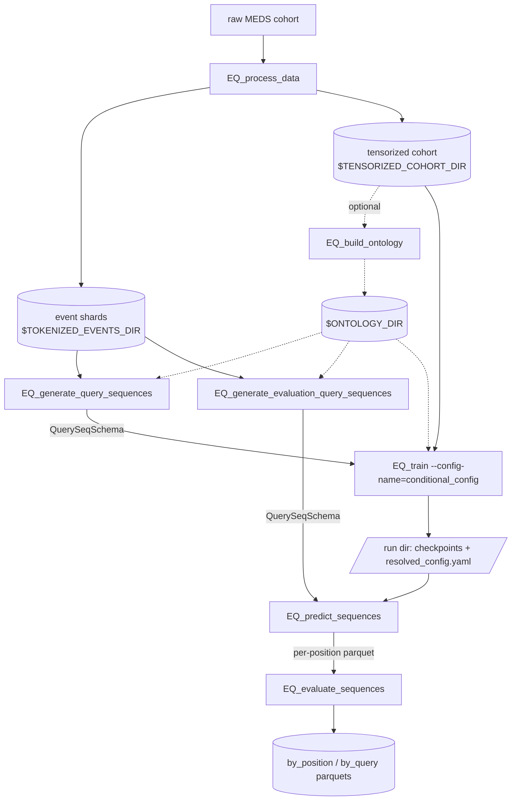
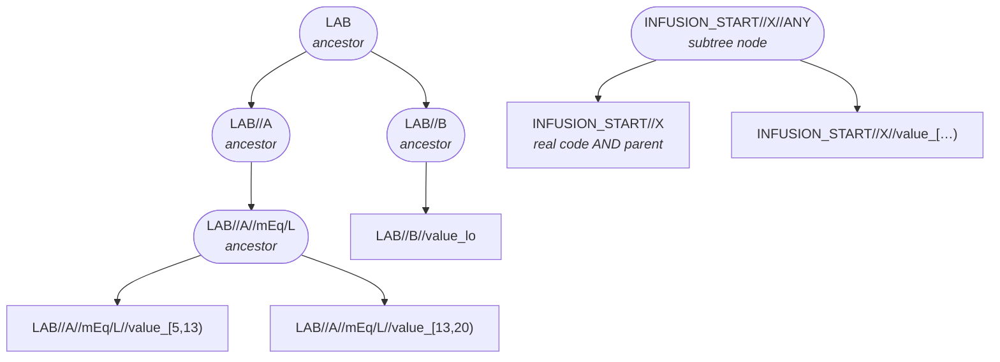

# EveryQuery — conditional query sequences

[](https://github.com/payalchandak/EveryQuery/actions/workflows/tests.yaml)
[](https://www.python.org)
[](https://lightning.ai)
[](https://hydra.cc)
[](LICENSE)

Given a [MEDS](https://github.com/Medical-Event-Data-Standard) dataset, EveryQuery trains a model
that answers an **ordered sequence of queries** about a patient:

> *Given the record up to time $t$, will code $c_1$ occur within $d_1$ days? Given that answer, will
> $c_2$ occur within $d_2$ days? …*

A bidirectional ModernBERT encoder embeds the patient record once; a block-autoregressive decoder
then answers each query conditioned on the patient state **and the (teacher-forced) answers to all
earlier queries**, i.e. it learns

$$
P(A_j \mid \text{patient},\, Q_1, \dots, Q_j,\, A_1, \dots, A_{j-1})
$$

rather than the marginal $P(A \mid \text{patient}, Q)$. Answers are binary
YES/NO. Censoring is not a label class — it is a query on the real end-of-record code
`TIMELINE//END` (`(TIMELINE//END, 30)=YES` means "the record ends within 30 days"), so later
queries can be conditioned on it. Queries can also be **event-bounded** ("does `c` occur before the
next `HOSPITAL_DISCHARGE`?") and, with an ontology, can address a whole **code family**
("does any `LAB//220645//*` occur?").

`docs/CONDITIONAL_QUERIES.md` is the design doc (model, masking, evaluation methodology,
results). The upstream single-query pipeline (`EQ_generate_training_tasks`, `EQ_predict`,
`EQ_evaluate`, …) still ships in the tree but is not covered here.

## Install

```bash
uv sync --group dev # from a checkout
# or
pip install EveryQuery
```

Every CLI below is a Hydra entry point: override any knob with `key=value`, add one with
`+key=value`, and print the resolved config with `--cfg job`. Path arguments are required
(`???` in the YAML) — there is no env-var fallback. `env.example.sh` lists the variables used
below; copy it to `env.sh`, edit, and `source env.sh` so they expand into the commands.

## Pipeline



### 1. Preprocess — `EQ_process_data`

```bash
EQ_process_data \
	input_dir="$DATA_DIR" \
	intermediate_dir="$TOKENIZED_EVENTS_DIR" \
	output_dir="$TENSORIZED_COHORT_DIR"
```

| Arg                | Meaning                                                                               |
| ------------------ | ------------------------------------------------------------------------------------- |
| `input_dir`        | raw MEDS cohort root (`data/{split}/*.parquet`, `metadata/codes.parquet`)             |
| `intermediate_dir` | MEDS-transforms staging; the string-coded event shards the samplers read              |
| `output_dir`       | tensorized cohort for training; `metadata/codes.parquet` here is the model vocabulary |
| `do_reshard=true`  | reshard the input first (default `false`)                                             |

### 2. (Optional) Build an ontology — `EQ_build_ontology`

```bash
EQ_build_ontology \
	tensorized_cohort_dir="$TENSORIZED_COHORT_DIR" \
	out_dir="$ONTOLOGY_DIR" \
	decay=0.5 \
	subtree_suffix=ANY
```

Run once per cohort. See [How the ontology works](#how-the-ontology-works). Every later step
takes `ontology_dir=$ONTOLOGY_DIR`; skip it everywhere (default `null`) to work with leaf codes
only. **The same directory must be used for generation, training and evaluation** — ancestor
token indices are assigned by the build, so mixing ontologies addresses the wrong embedding rows
(the dataset raises on unknown codes).

### 3. Generate training sequences — `EQ_generate_query_sequences`

```bash
EQ_generate_query_sequences \
	data_dir="$TOKENIZED_EVENTS_DIR" \
	out_dir="$TRAINING_TASKS_DIR" \
	query_codes="$TENSORIZED_COHORT_DIR" \
	split=train \
	num_training_sequence_examples=4096 \
	ontology_dir="$ONTOLOGY_DIR" # omit for leaf codes only
```

Samples `num_training_sequence_examples` random `(subject, prediction_time)` contexts across the whole split, draws
an i.i.d. query sequence for each, and labels every query by observed occurrence. Output:
`{out_dir}/{split}/{shard}.parquet` in `QuerySeqSchema` — one row per context with aligned list
columns `queries`, `durations` (float days), `answers` (bool) and, when `eventbound_fraction > 0`,
`bound_events`. Run it for `split=train` and `split=tuning` (training validates on `tuning`).

| Knob                                                      | Default                 | Meaning                                                                                                                       |
| --------------------------------------------------------- | ----------------------- | ----------------------------------------------------------------------------------------------------------------------------- |
| `query_codes`                                             | required                | query universe: a tensorized-cohort root (reads `metadata/codes.parquet`), an inline list `[HR,TEMP]`, or a YAML/parquet path |
| `num_training_sequence_examples`                                           | 4096                    | total sequences over the split (global budget, not per shard)                                                                 |
| `min_queries` / `max_queries`                             | 1 / 5                   | sequence length ~ Uniform{min..max}                                                                                           |
| `duration_min` / `duration_max` / `duration_distribution` | 1 / 731 / `log-uniform` | per-query horizon draw, continuous days                                                                                       |
| `eventbound_fraction`                                     | 0.5                     | fraction of queries bounded by the next occurrence of a random boundary event instead of a horizon                            |
| `eos_first_fraction`                                      | 0.0                     | probability a sequence starts with `TIMELINE//END`                                                                            |
| `duration_mode`                                           | `random`                | `random` \| `same` \| `nondecreasing` horizons within a sequence                                                              |
| `min_prediction_times_per_subject`                        | 50                      | eligibility threshold for a prediction time                                                                                   |
| `ontology_dir`                                            | null                    | adds every ancestor node to the query/boundary universe and labels ancestor queries via descendants                           |
| `max_workers`                                             | cores                   | shard-labeling parallelism (raise → more RAM)                                                                                 |
| `seed`                                                    | 1                       | per-shard seeds also mix in the shard id, so no two shards draw the same queries                                              |

Intermediates (prediction-time counts, sequence index) land in the sibling
`{out_dir}_artifacts/`; `out_dir` holds final parquets only.

### 4. Generate evaluation sequences — `EQ_generate_evaluation_query_sequences`

Labels the **same** `N` sequences at every evaluation context, so metrics are comparable
query-for-query across cohorts. Two ways to choose the sequences:

**a) Sampled from the training distribution** (positional/macro evaluation):

```bash
EQ_generate_evaluation_query_sequences \
	data_dir="$TOKENIZED_EVENTS_DIR" \
	out_dir="$EVAL_SEQ_TASKS_DIR" \
	query_codes="$TENSORIZED_COHORT_DIR" \
	split=held_out \
	prediction_times_per_subject=1 \
	num_evaluation_sequences=64 \
	ontology_dir="$ONTOLOGY_DIR"
```

The sampling knobs (`min/max_queries`, `duration_*`, `eventbound_fraction`, …) mirror step 3; pass
the same overrides you trained with, or the grid is silently out of distribution.

**b) Designed sequences** via `sequences_path=` — nothing is sampled, `query_codes` only validates
the vocabulary:

```yaml
# designed.yaml   name -> [[code, duration_days], ...]   (a triple sets an event bound)
mortality_30d_uncensored:
  - [TIMELINE//END, 30]      # condition on "record continues past 30d"
  - [MEDS_DEATH, 30]
sepsis_before_discharge:
  - [SEPSIS, -1, HOSPITAL_DISCHARGE//HOME]
any_sodium_lab_7d:
  - [LAB//220645//ANY, 7]     # ancestor query (needs ontology_dir)
```

```bash
EQ_generate_evaluation_query_sequences ... sequences_path=designed.yaml
```

A long-format parquet `(seq_id, position, query, duration_days[, bound_event])` works too.

Cohort knobs: `prediction_times_per_subject`, `min_context_per_subject` (prior events, default 50),
`subject_subsample_fraction`, or `contexts_path=` — a parquet of `(subject_id, prediction_time)`
labeled verbatim (e.g. 24h-post-admission anchors).

Output: `{out_dir}/eval/{split}/{shard}.parquet` (pass `{out_dir}/eval` to predict) plus the
deduplicated contexts under `{out_dir}/eval_unique/`. Use a different `out_dir` from the
single-query `EQ_generate_evaluation_tasks`; they share the layout but not the schema.

### 5. Train — `EQ_train --config-name=conditional_config`

```bash
EQ_train --config-name=conditional_config \
	output_dir="$TRAINING_OUTPUT_DIR" \
	datamodule.config.tensorized_cohort_dir="$TENSORIZED_COHORT_DIR" \
	datamodule.config.task_labels_dir="$TRAINING_TASKS_DIR" \
	lightning_module.model.ontology_dir="$ONTOLOGY_DIR" # omit for leaf codes only
```

Each launch lands in `{output_dir}/<date>/<time>/` with `checkpoints/`, `loggers/csv/metrics.csv`
and `resolved_config.yaml` — that run dir is what `EQ_predict_sequences` consumes. Vocabulary size
and max positions are sized from the cohort (or the ontology's extended vocabulary) automatically.

Common overrides (full list: `src/every_query/train/configs/conditional_config.yaml`):

| Knob                                                          | Default                                                     |
| ------------------------------------------------------------- | ----------------------------------------------------------- |
| `datamodule.batch_size` / `datamodule.num_workers`            | 96 / 8                                                      |
| `datamodule.config.max_seq_len`                               | 256 patient tokens                                          |
| `lightning_module.model.num_hidden_layers` / `decoder_layers` | 8 / 4 (hidden 384, 6 heads)                                 |
| `lightning_module.model.max_queries`                          | 8 (≥ the longest sequence in your labels)                   |
| `lightning_module.model.use_rope_time`                        | false — `true` uses elapsed hours as rotary positions       |
| `lightning_module.optimizer.lr` / `warmup_ratio`              | 2e-4 / 0.05                                                 |
| `trainer.max_epochs` / `trainer.precision`                    | 1 / `bf16-mixed`                                            |
| `do_resume=true`                                              | resume the run in `output_dir` (mid-epoch, stateful loader) |
| `seed`                                                        | 140799                                                      |

Checkpointing and early stopping monitor `tuning/loss`. `ontology_dir` is set once on the model;
the datamodule interpolates it.

### 6. Predict — `EQ_predict_sequences`

```bash
EQ_predict_sequences \
	model_run_dir="$TRAINING_OUTPUT_DIR/YYYY-MM-DD/HH-MM-SS" \
	tasks_dir="$EVAL_SEQ_TASKS_DIR/eval" \
	output_parquet="$TRAINING_OUTPUT_DIR/predictions.parquet" \
	split=held_out
```

Runs teacher-forced inference (each answer is conditioned on the ground-truth earlier answers)
over every `QuerySeqSchema` parquet under `tasks_dir`. Output is flat, one row per query position:
`subject_id, prediction_time, position, query, duration_days, answer, answer_prob[, bound_event]`.
Options: `ckpt_name=` (checkpoint stem under `checkpoints/`, default best), `batch_size=`,
`overwrite=true`. `split=train` is refused.

### 7. Evaluate — `EQ_evaluate_sequences`

```bash
EQ_evaluate_sequences \
	predictions_parquet="$TRAINING_OUTPUT_DIR/predictions.parquet" \
	metrics_stem="$TRAINING_OUTPUT_DIR/metrics"
```

Writes `metrics.by_position.parquet` (AUROC / `n_rows` / `prevalence` per sequence position) and
`metrics.by_query.parquet` (the same per `(query, duration_bucket)`, with an `event-bound` bucket).

> Report **macro (per-query) AUROC**, not AUROC pooled over queries. Pooled AUROC scores
> cross-query pairs and is inflated by base-rate differences (≈0.91 pooled vs ≈0.77 per task on
> MIMIC-IV). `scripts/eval_macro_position.py` is the paired estimator behind the headline
> position-trend result; `scripts/eval_clinical.py` covers designed clinical tasks. See
> `docs/CONDITIONAL_QUERIES.md` §4.

## How the ontology works

MEDS code names are already a hierarchy: `LAB//A//mEq/L//value_[5,13)` sits under
`LAB//A//mEq/L`, under `LAB//A`, under `LAB`. `EQ_build_ontology` reads the cohort's
`metadata/codes.parquet` (plus an explicit `parent_codes` column if present) and turns every
`//`-prefix into a DAG node:



Rectangles are observed leaf codes (they appear in patient streams and keep their cohort token
ids); rounded nodes are ancestors minted by the build (fresh ids above the highest leaf). A query
on `LAB//A` is answered YES if *any* of its descendants occurs. A name that is both a real code and
a parent (`INFUSION_START//X`) keeps its exact meaning and gets a `//ANY` sibling for the subtree
meaning. The build writes three parquets to `out_dir`:

| File                           | Contents                                                                                                                                                         |
| ------------------------------ | ---------------------------------------------------------------------------------------------------------------------------------------------------------------- |
| `ontology_vocab.parquet`       | `(node_name, token_id, is_observed_code)` — the extended vocabulary. Leaf codes keep their cohort indices; ancestor nodes get fresh ones above the highest leaf. |
| `embedding_mix.parquet`        | sparse $A$ with entry $\text{decay}^{\,\text{distance}}$ for each (node, ancestor) pair plus a self-loop                                                         |
| `event_to_query_nodes.parquet` | `(event_code, query_node)` closure: every leaf paired with itself and each ancestor it satisfies                                                                 |

Setting `ontology_dir` does two things:

1. **Ancestors become queryable.** The samplers add every ancestor node to the query and
    boundary-event universe (each leaf and ancestor drawn with equal probability), and label an
    ancestor query by exploding the event stream through the closure — "did any descendant occur?".
    The model's embedding table is sized to the extended vocabulary, so an ancestor is an ordinary
    query token at prediction time.
2. **Embeddings are ontology-mixed.** The encoder's input embedding becomes $(A W)[\text{ids}]$: each
    code's vector is the row-normalised weighted average of its own row and its ancestors'. A rare
    leaf is pulled toward its better-estimated parents, and an ancestor node (never seen in a patient
    stream) still gets gradient through its descendants. `decay=0` keeps the structure with no mixing.

**Dual-role names.** A name that is both a real code and another code's prefix (e.g.
`INFUSION_START//X` is an unvalued event *and* the parent of its `//value_[…)` bins) gets a
sibling subtree node `INFUSION_START//X//ANY` meaning "this code or any descendant"; the bare name
stays exact. `subtree_suffix=null` disables this.

## Development

```bash
uv run pytest                                                                 # full suite minus slow tests (~2 min)
uv run pytest tests/test_conditional_queries.py tests/test_conditional_cli.py # this pipeline
uv run pytest tests/test_cli_smoke.py                                         # every EQ_* --help exits 0
uv run pre-commit run --all-files                                             # ruff lint + format + codespell
```

`tests/test_conditional_cli.py` runs the full generate → train → predict → evaluate chain on a
fixture cohort. `pytest` runs with `--doctest-modules --doctest-glob=*.md`, so code examples in
docstrings and Markdown execute as tests.

## Acknowledgements

Built on [MEDS](https://github.com/Medical-Event-Data-Standard),
[`meds-torch-data`](https://github.com/mmcdermott/meds-torch-data),
[`MEDS-transforms`](https://github.com/mmcdermott/MEDS_transforms), and
[`MEDS_EIC_AR`](https://github.com/mmcdermott/MEDS_EIC_AR); uses [Hydra](https://hydra.cc),
[PyTorch Lightning](https://lightning.ai) and [W&B](https://wandb.ai).

## License

MIT — see [LICENSE](LICENSE).
